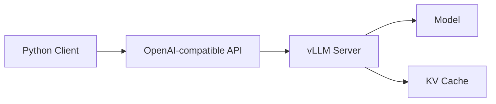

# AGENTS.md

## 1. Project Purpose

This project is a **local-first practical vLLM learning project** for users who are new to vLLM.

The main goal is to help users run vLLM locally, call it from Python, and learn practical serving concepts step by step.

The primary learning path is:

```text
Create .env
→ Run vLLM locally
→ Call it with a Python client
→ Change generation settings
→ Run local benchmarks
→ Try practical vLLM features
→ Optionally start Docker and Kubernetes examples only as smoke tests
```

Docker and Kubernetes are **not the main learning path**.

They are included only to let users start a vLLM server once and verify that the same Python client can call it.

RunPod is not used in this project.

---

## 2. Target Audience

The target learner is a user who is new to vLLM.

Assume the learner:

- Knows basic Python.
- May not know vLLM.
- May not know LLM serving.
- May not know CUDA internals.
- Wants to run something locally first.
- Wants practical examples more than deep theory.

Do not assume the learner is an ML infrastructure expert.

For Kubernetes examples only:

- Assume the learner already knows Kubernetes basics.
- Do not teach Kubernetes fundamentals.
- Do not explain what Pod, Deployment, Service, Namespace, Secret, or PVC means from scratch.
- Use Kubernetes only as a kind-based smoke test.

---

## 3. Non-Goals

This project must not become:

- A vLLM internals deep dive.
- A Kubernetes tutorial.
- A Docker tutorial.
- A RunPod tutorial.
- A production LLM platform guide.
- A multi-node serving guide.
- A GPU infrastructure comparison guide.

Do not include RunPod.

Do not use remote GPU providers as part of the default project.

Do not make Docker or Kubernetes required for the main learning path.

---

## 4. Core Learning Philosophy

Follow these principles:

1. **Local execution first.**
2. **Run first, explain next.**
3. **Use small models by default.**
4. **Manage all common settings with `.env`.**
5. **Use the same Python client across local, Docker, and kind examples.**
6. **Keep Docker and Kubernetes as optional smoke tests.**
7. **Keep each chapter focused on one goal.**
8. **Move theory into appendices.**
9. **Avoid backend comparisons unless required for setup.**
10. **Never expose real tokens or secrets.**

---

## 5. Required Project Structure

Use this structure:

```text
vllm-practical-lab/
  AGENTS.md
  README.md
  pyproject.toml
  uv.lock
  .env.example
  .gitignore
  Makefile

  src/
    vllm_lab/
      __init__.py
      config.py
      client.py
      health.py
      prompts.py
      benchmark.py
      benchmark_matrix.py

  scripts/
    local_serve_help.py
    offline_generate.py
    offline_chat.py
    call_chat.py
    call_completion.py
    healthcheck.py
    run_sampling_test.py
    run_prefix_cache_test.py
    run_lora_test.py
    run_speculative_test.py
    run_benchmark.py
    run_benchmark_matrix.py

  configs/
    models.small.toml
    prompts.toml
    benchmark.toml

  deploy/
    docker/
      docker-compose.yml
      README.md

    k8s/
      README.md
      kind/
        kind-cluster.yaml
      base/
        namespace.yaml
        secret.example.yaml
        deployment.yaml
        service.yaml
      overlays/
        kind-smoke/
          kustomization.yaml

  docs/
    setup/
      00_choose_your_environment.md
      01_common_env.md
      02_local_nvidia_linux.md
      03_windows_nvidia_wsl.md
      04_apple_silicon.md
      05_docker_smoke.md
      06_kubernetes_kind_smoke.md
      07_troubleshooting.md

    labs/
      01_why_vllm.md
      02_local_first_server.md
      03_first_python_client.md
      04_sampling.md
      05_local_benchmark.md
      06_prefix_caching.md
      07_lora_serving.md
      08_speculative_decoding.md
      09_docker_smoke.md
      10_kubernetes_kind_smoke.md

    appendix/
      01_llm_basics.md
      02_transformer_attention.md
      03_prefill_decode.md
      04_kv_cache.md
      05_batching.md
      06_quantization.md
      07_lora_qlora.md
      08_mermaid_summary.md

  tests/
    test_config.py
    test_client.py
    test_health.py
    test_benchmark_config.py
```

Do not create a notebook-first project.

Notebooks may exist only as optional companion material.

---

## 6. Environment and Configuration Policy

All common settings must be managed through `.env` and `.env.example`.

Do not hard-code common settings in:

- Python scripts
- Docker Compose files
- Kubernetes manifests
- Markdown snippets
- Notebooks
- Test files

The only exception is clearly fake placeholder values.

### 6.1 Required `.env.example`

Create `.env.example` with this structure:

```env
# ------------------------------------------------------------
# Common Lab Settings
# ------------------------------------------------------------

LAB_ENV=local
LAB_LOG_LEVEL=INFO

# ------------------------------------------------------------
# vLLM Server Settings
# ------------------------------------------------------------

VLLM_HOST=0.0.0.0
VLLM_PORT=8000
VLLM_BASE_URL=http://localhost:8000/v1
VLLM_API_KEY=EMPTY

# ------------------------------------------------------------
# Model Profile Settings
# ------------------------------------------------------------

MODEL_PROFILE=default

MODEL_TINY=Qwen/Qwen2.5-0.5B-Instruct
MODEL_DEFAULT=Qwen/Qwen3-0.6B
MODEL_SMALL_CHAT=Qwen/Qwen2.5-1.5B-Instruct
MODEL_BALANCED=Qwen/Qwen2.5-3B-Instruct
MODEL_ADVANCED=meta-llama/Llama-3.2-3B-Instruct

DEFAULT_TOKENIZER=
DEFAULT_DTYPE=auto
DEFAULT_MAX_MODEL_LEN=4096

# ------------------------------------------------------------
# Hugging Face Settings
# ------------------------------------------------------------

HF_TOKEN=
HF_HOME=.cache/huggingface

# ------------------------------------------------------------
# Sampling Defaults
# ------------------------------------------------------------

DEFAULT_TEMPERATURE=0.7
DEFAULT_TOP_P=0.9
DEFAULT_MAX_TOKENS=256

# ------------------------------------------------------------
# Prefix Caching
# ------------------------------------------------------------

ENABLE_PREFIX_CACHING=false

# ------------------------------------------------------------
# LoRA Serving
# ------------------------------------------------------------

ENABLE_LORA=false
LORA_MODULE_NAME=
LORA_MODULE_PATH=

# ------------------------------------------------------------
# Speculative Decoding
# ------------------------------------------------------------

ENABLE_SPECULATIVE_DECODING=false
SPECULATIVE_CONFIG_JSON=

# ------------------------------------------------------------
# Local Benchmark Settings
# ------------------------------------------------------------

BENCHMARK_OUTPUT_DIR=results/benchmarks
BENCHMARK_NUM_PROMPTS=20
BENCHMARK_REQUEST_RATE=2
BENCHMARK_MAX_CONCURRENCY=4
BENCHMARK_PROMPT_PRESET=short
BENCHMARK_RESULT_FORMAT=markdown

# Benchmark matrix values are comma-separated.
BENCHMARK_MODEL_PROFILES=tiny,default
BENCHMARK_MAX_TOKENS_LIST=64,128,256
BENCHMARK_REQUEST_RATE_LIST=1,2,4
BENCHMARK_PROMPT_PRESET_LIST=short,medium,long
BENCHMARK_PREFIX_CACHE_LIST=false,true

# ------------------------------------------------------------
# Docker Smoke Test Settings
# ------------------------------------------------------------

DOCKER_IMAGE=vllm/vllm-openai:latest
DOCKER_CONTAINER_NAME=vllm-lab-server
DOCKER_PORT=8000

# ------------------------------------------------------------
# Kubernetes kind Smoke Test Settings
# ------------------------------------------------------------

K8S_LOCAL_RUNTIME=kind
K8S_CLUSTER_NAME=vllm-lab
K8S_NAMESPACE=vllm-lab
K8S_SERVICE_NAME=vllm-server
K8S_CONTAINER_PORT=8000
K8S_LOCAL_PORT=8000
```

### 6.2 Model Profile Resolution

Do not rely on shell expansion like this:

```env
DEFAULT_MODEL=${MODEL_DEFAULT}
```

Instead, resolve the model in Python based on `MODEL_PROFILE`.

Recommended behavior:

| `MODEL_PROFILE` | Model variable |
|---|---|
| `tiny` | `MODEL_TINY` |
| `default` | `MODEL_DEFAULT` |
| `small-chat` | `MODEL_SMALL_CHAT` |
| `balanced` | `MODEL_BALANCED` |
| `advanced` | `MODEL_ADVANCED` |

Example:

```python
# src/vllm_lab/config.py

from dataclasses import dataclass
from dotenv import load_dotenv
import os

load_dotenv()

def resolve_default_model() -> str:
    profile = os.getenv("MODEL_PROFILE", "default")

    profile_to_env = {
        "tiny": "MODEL_TINY",
        "default": "MODEL_DEFAULT",
        "small-chat": "MODEL_SMALL_CHAT",
        "balanced": "MODEL_BALANCED",
        "advanced": "MODEL_ADVANCED",
    }

    env_name = profile_to_env.get(profile, "MODEL_DEFAULT")
    return os.getenv(env_name, os.getenv("MODEL_DEFAULT", "Qwen/Qwen3-0.6B"))

@dataclass(frozen=True)
class Settings:
    lab_env: str = os.getenv("LAB_ENV", "local")
    log_level: str = os.getenv("LAB_LOG_LEVEL", "INFO")

    vllm_host: str = os.getenv("VLLM_HOST", "0.0.0.0")
    vllm_port: int = int(os.getenv("VLLM_PORT", "8000"))
    vllm_base_url: str = os.getenv("VLLM_BASE_URL", "http://localhost:8000/v1")
    vllm_api_key: str = os.getenv("VLLM_API_KEY", "EMPTY")

    model_profile: str = os.getenv("MODEL_PROFILE", "default")
    default_model: str = resolve_default_model()
    default_tokenizer: str | None = os.getenv("DEFAULT_TOKENIZER") or None
    default_dtype: str = os.getenv("DEFAULT_DTYPE", "auto")
    default_max_model_len: int = int(os.getenv("DEFAULT_MAX_MODEL_LEN", "4096"))

    hf_token: str | None = os.getenv("HF_TOKEN") or None
    hf_home: str = os.getenv("HF_HOME", ".cache/huggingface")

    default_temperature: float = float(os.getenv("DEFAULT_TEMPERATURE", "0.7"))
    default_top_p: float = float(os.getenv("DEFAULT_TOP_P", "0.9"))
    default_max_tokens: int = int(os.getenv("DEFAULT_MAX_TOKENS", "256"))

settings = Settings()
```

All scripts must import `settings` from `vllm_lab.config`.

---

## 7. Default Model Recommendation Policy

Provide multiple beginner-friendly model profiles.

Recommended profiles:

| Profile | Model | Purpose |
|---|---|---|
| `tiny` | `Qwen/Qwen2.5-0.5B-Instruct` | First successful run on limited resources |
| `default` | `Qwen/Qwen3-0.6B` | Default local learning model |
| `small-chat` | `Qwen/Qwen2.5-1.5B-Instruct` | Better chat quality while still small |
| `balanced` | `Qwen/Qwen2.5-3B-Instruct` | Local GPU learning when resources allow |
| `advanced` | `meta-llama/Llama-3.2-3B-Instruct` | Optional advanced model, may require HF access |

Default profile:

```env
MODEL_PROFILE=default
```

For the first run, documentation may recommend:

```env
MODEL_PROFILE=tiny
```

Do not use large or gated models as default.

Large models may appear only in optional advanced notes.

---

## 8. Local-First Execution Policy

The main project must assume the user runs vLLM locally.

The main path should use:

```bash
vllm serve <model>
```

The exact command should be shown using values from `.env`.

Example generated command:

```bash
vllm serve Qwen/Qwen3-0.6B \
  --host 0.0.0.0 \
  --port 8000 \
  --dtype auto \
  --max-model-len 4096
```

The user should then verify:

```bash
python scripts/healthcheck.py
python scripts/call_chat.py
```

The local server path is the primary learning path.

---

## 9. Python Client Policy

Use the OpenAI-compatible API style for the main project.

All user-facing scripts should call vLLM through `VLLM_BASE_URL`.

Recommended client:

```python
# src/vllm_lab/client.py

from openai import OpenAI
from vllm_lab.config import settings

def create_client() -> OpenAI:
    return OpenAI(
        base_url=settings.vllm_base_url,
        api_key=settings.vllm_api_key,
    )
```

Example script:

```python
# scripts/call_chat.py

from vllm_lab.client import create_client
from vllm_lab.config import settings

def main() -> None:
    client = create_client()

    response = client.chat.completions.create(
        model=settings.default_model,
        messages=[
            {"role": "user", "content": "Explain vLLM in one simple sentence."}
        ],
        temperature=settings.default_temperature,
        top_p=settings.default_top_p,
        max_tokens=settings.default_max_tokens,
    )

    print(response.choices[0].message.content)

if __name__ == "__main__":
    main()
```

---

## 10. Setup Documentation Policy

Environment setup must be separate from learning labs.

Use:

```text
docs/setup/
  00_choose_your_environment.md
  01_common_env.md
  02_local_nvidia_linux.md
  03_windows_nvidia_wsl.md
  04_apple_silicon.md
  05_docker_smoke.md
  06_kubernetes_kind_smoke.md
  07_troubleshooting.md
```

Do not include RunPod setup.

Do not include `colab_runpod.md`.

Do not deeply compare environments.

The setup docs should only help users prepare enough to run the local-first labs.

---

## 11. Main Lab Sequence

Use this sequence:

```text
01_why_vllm.md
02_local_first_server.md
03_first_python_client.md
04_sampling.md
05_local_benchmark.md
06_prefix_caching.md
07_lora_serving.md
08_speculative_decoding.md
09_docker_smoke.md
10_kubernetes_kind_smoke.md
```

### Lab 1. Why vLLM?

Goal:

- Explain why vLLM is used.
- Explain local serving in simple terms.
- Explain that this project uses an OpenAI-compatible Python client.

### Lab 2. Local First Server

Goal:

- Run the first local vLLM server.
- Use `.env` values.
- Verify with `/health` or `/v1/models`.

### Lab 3. First Python Client

Goal:

- Call the local vLLM server with Python.
- Use the same client used throughout the project.

### Lab 4. Sampling

Goal:

- Change `temperature`, `top_p`, and `max_tokens`.
- Observe output differences.

### Lab 5. Local Benchmark

Goal:

- Benchmark the local vLLM server.
- Help users learn by changing `.env` values.
- Generate a simple report.

### Lab 6. Prefix Caching

Goal:

- Explain prefix caching with repeated long prompts.
- Show where it helps.

### Lab 7. LoRA Serving

Goal:

- Serve an existing LoRA adapter.
- Do not teach LoRA training.

### Lab 8. Speculative Decoding

Goal:

- Compare baseline and speculative decoding settings.
- Do not claim it always improves performance.

### Lab 9. Docker Smoke Test

Goal:

- Start a vLLM server with Docker.
- Verify health.
- Call it with the same Python client.
- Do not teach Docker deeply.

### Lab 10. Kubernetes kind Smoke Test

Goal:

- Start a vLLM server on kind.
- Verify health.
- Port-forward the service.
- Call it with the same Python client.
- Do not teach Kubernetes basics.

---

## 12. Benchmark Learning Policy

Benchmarking must be a learning tool, not a single fixed command.

Users should be able to change `.env` values and compare results.

Provide:

```text
scripts/run_benchmark.py
scripts/run_benchmark_matrix.py
docs/labs/05_local_benchmark.md
docs/labs/05_benchmark_report_template.md
```

### 12.1 Benchmark Variables

The benchmark lab should help users compare:

- Model profile
- Max tokens
- Prompt length
- Request rate
- Prefix caching on/off
- Speculative decoding on/off, if available

### 12.2 Benchmark Matrix

Use `.env` values such as:

```env
BENCHMARK_MODEL_PROFILES=tiny,default
BENCHMARK_MAX_TOKENS_LIST=64,128,256
BENCHMARK_REQUEST_RATE_LIST=1,2,4
BENCHMARK_PROMPT_PRESET_LIST=short,medium,long
BENCHMARK_PREFIX_CACHE_LIST=false,true
```

`run_benchmark_matrix.py` should run combinations of these values.

It should write results to:

```text
results/benchmarks/
```

Recommended outputs:

```text
results/benchmarks/latest.csv
results/benchmarks/latest.md
```

### 12.3 Benchmark Report Format

Use a simple Markdown table:

```markdown
| Model Profile | Max Tokens | Prompt Preset | Request Rate | Prefix Cache | Avg Latency | Throughput | Notes |
|---|---:|---|---:|---|---:|---:|---|
| tiny | 64 | short | 1 | false |  |  |  |
| tiny | 128 | short | 1 | false |  |  |  |
| default | 128 | medium | 2 | true |  |  |  |
```

Explain metrics simply.

Do not overwhelm beginners with too many performance terms.

---

## 13. Docker Policy

Docker is only a smoke test path.

Docker is not the main learning environment.

Docker docs should show:

```text
Start container
→ Check health
→ Call from Python client
→ Stop container
```

Do not teach Docker fundamentals.

Do not introduce production Docker optimization.

Use `.env` values.

Use the official vLLM OpenAI-compatible image.

Example `deploy/docker/docker-compose.yml`:

```yaml
services:
  vllm:
    image: ${DOCKER_IMAGE:-vllm/vllm-openai:latest}
    container_name: ${DOCKER_CONTAINER_NAME:-vllm-lab-server}
    ipc: host
    environment:
      HF_TOKEN: ${HF_TOKEN}
    volumes:
      - ${HF_HOME:-.cache/huggingface}:/root/.cache/huggingface
    ports:
      - "${DOCKER_PORT:-8000}:8000"
    command:
      - --model
      - ${MODEL_DEFAULT:-Qwen/Qwen3-0.6B}
      - --host
      - 0.0.0.0
      - --port
      - "8000"
      - --dtype
      - ${DEFAULT_DTYPE:-auto}
      - --max-model-len
      - ${DEFAULT_MAX_MODEL_LEN:-4096}
```

The documentation should state that local `vllm serve` remains the main path.

---

## 14. Kubernetes Policy

Kubernetes examples must use **kind**.

Kubernetes is only a smoke test path.

Kubernetes is not the main learning environment.

Use kind for:

- Local Kubernetes smoke test.
- Manifest validation.
- Starting the vLLM server once.
- Port-forwarding the service.
- Calling it with the same Python client.

Do not use RunPod.

Do not use k3d.

Do not use minikube as the default.

Do not teach Kubernetes fundamentals.

The Kubernetes lab assumes the user already knows:

```text
kubectl
kind
Namespace
Secret
Deployment
Service
port-forward
```

### 14.1 Required Kubernetes Files

Use:

```text
deploy/k8s/
  README.md

  kind/
    kind-cluster.yaml

  base/
    namespace.yaml
    secret.example.yaml
    deployment.yaml
    service.yaml

  overlays/
    kind-smoke/
      kustomization.yaml
```

Do not add complex Kubernetes structure unless needed.

Do not add Helm.

Do not add KServe.

Do not add autoscaling.

### 14.2 kind Cluster Config

Use:

```yaml
kind: Cluster
apiVersion: kind.x-k8s.io/v1alpha4
name: vllm-lab
nodes:
  - role: control-plane
```

### 14.3 Kubernetes Lab Flow

Use:

```bash
kind create cluster --config deploy/k8s/kind/kind-cluster.yaml
kubectl apply -k deploy/k8s/overlays/kind-smoke
kubectl get pods -n vllm-lab
kubectl port-forward -n vllm-lab svc/vllm-server 8000:8000
python scripts/healthcheck.py
python scripts/call_chat.py
```

### 14.4 Kubernetes Secret Policy

Never commit real secrets.

Only provide:

```text
secret.example.yaml
```

Example:

```yaml
apiVersion: v1
kind: Secret
metadata:
  name: hf-token-secret
  namespace: vllm-lab
type: Opaque
stringData:
  HF_TOKEN: "replace-me"
```

The user must create their own local secret if needed.

---

## 15. Appendix Policy

Conceptual materials go under `docs/appendix`.

Appendices should be easy to read.

Use Mermaid diagrams.

Avoid heavy math.

Recommended appendices:

```text
01_llm_basics.md
02_transformer_attention.md
03_prefill_decode.md
04_kv_cache.md
05_batching.md
06_quantization.md
07_lora_qlora.md
08_mermaid_summary.md
```

Good Mermaid example:



Do not put complex theory in the main labs.

---

## 16. Agent Roles

### 16.1 Project Planner Agent

Responsibilities:

- Keep the project local-first.
- Keep Docker and Kubernetes as smoke tests.
- Remove RunPod from the project.
- Keep common settings in `.env`.
- Keep the learning order beginner-friendly.

### 16.2 Documentation Agent

Responsibilities:

- Write beginner-friendly English documentation.
- Focus on one goal per document.
- Add verification steps.
- Add common errors.
- Use Mermaid diagrams in appendices.
- Avoid unnecessary jargon.

### 16.3 Python Implementation Agent

Responsibilities:

- Write reusable code under `src/vllm_lab`.
- Write executable scripts under `scripts`.
- Load settings only from `vllm_lab.config`.
- Keep scripts readable.
- Provide helpful error messages.

### 16.4 Benchmark Agent

Responsibilities:

- Implement local benchmark scripts.
- Implement benchmark matrix scripts.
- Write CSV and Markdown reports.
- Make benchmark settings configurable from `.env`.
- Explain benchmark results simply.

### 16.5 Docker Agent

Responsibilities:

- Maintain Docker smoke test examples.
- Use `.env` values.
- Start, verify, call, and stop.
- Do not teach Docker deeply.

### 16.6 Kubernetes Agent

Responsibilities:

- Maintain kind-based smoke test examples.
- Assume Kubernetes knowledge.
- Do not teach Kubernetes basics.
- Use port-forward for local testing.
- Avoid Helm, KServe, and autoscaling.

### 16.7 Reviewer Agent

Responsibilities:

- Check local-first learning flow.
- Check that Docker and Kubernetes are optional smoke tests.
- Check that RunPod is not included.
- Check that `.env` is used consistently.
- Check that no secrets are exposed.
- Check that default models are small enough.
- Check that benchmark settings are useful for learning.

---

## 17. Testing Policy

Unit tests should focus on project code.

Test:

```text
config.py
client.py
health.py
benchmark.py
```

Do not require a running vLLM server for normal unit tests.

Server-dependent checks should be scripts:

```bash
python scripts/healthcheck.py
python scripts/call_chat.py
```

Example:

```python
def test_default_model_exists():
    from vllm_lab.config import settings

    assert settings.default_model
```

---

## 18. Makefile Policy

Provide simple commands:

```makefile
setup:
	uv sync

health:
	python scripts/healthcheck.py

chat:
	python scripts/call_chat.py

sampling:
	python scripts/run_sampling_test.py

benchmark:
	python scripts/run_benchmark.py

benchmark-matrix:
	python scripts/run_benchmark_matrix.py

docker-up:
	docker compose -f deploy/docker/docker-compose.yml up

docker-down:
	docker compose -f deploy/docker/docker-compose.yml down

k8s-create:
	kind create cluster --config deploy/k8s/kind/kind-cluster.yaml

k8s-apply:
	kubectl apply -k deploy/k8s/overlays/kind-smoke

k8s-forward:
	kubectl port-forward -n vllm-lab svc/vllm-server 8000:8000

test:
	pytest -q
```

---

## 19. README Requirements

README must clearly state:

```text
This is a local-first vLLM learning project.
Docker and Kubernetes are optional smoke tests.
RunPod is not used.
Common settings are managed through .env.
```

README must include:

- Project purpose
- Target audience
- What users will learn
- Quick start
- `.env` setup
- Local-first learning path
- Model profile guide
- Benchmark guide
- Docker smoke test
- Kubernetes kind smoke test
- Security warning

---

## 20. Forbidden Practices

Do not:

- Include RunPod.
- Make Docker required.
- Make Kubernetes required.
- Teach Kubernetes fundamentals.
- Use k3d as default.
- Use minikube as default.
- Commit real `.env` files.
- Commit real tokens.
- Hard-code `HF_TOKEN`.
- Hard-code shared model names across scripts.
- Use large gated models as default.
- Put advanced theory before the first successful local run.
- Make notebooks the primary interface.
- Claim speculative decoding always improves performance.
- Present Kubernetes kind examples as production deployment.

---

## 21. Completion Criteria

The project is complete when:

- A user can create `.env` from `.env.example`.
- A user can choose a model profile.
- A user can run vLLM locally.
- A user can call the local server with Python.
- A user can change sampling settings.
- A user can run a local benchmark.
- A user can compare benchmark results by changing `.env` values.
- A user can understand prefix caching at a practical level.
- A user can try LoRA serving if resources allow.
- A user can try speculative decoding if resources allow.
- A user can start the Docker smoke test.
- A Kubernetes user can start the kind smoke test.
- No RunPod content exists.
- No real secrets are committed.

---

## 22. Final Project Message

This project is not a production LLM platform guide.

This project is a local-first vLLM learning project.

A successful learner should be able to say:

> I can configure `.env`, run vLLM locally, call it with Python, change settings, benchmark the results, and optionally start Docker and kind smoke tests.
