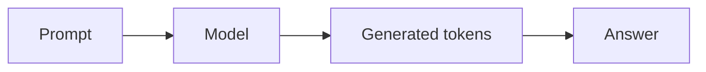

# 부록 1: LLM 기본

[문서 목차로 돌아가기](../README.md)

## 이 문서를 언제 읽나요?

실습 1을 읽은 뒤 prompt, token, generation이라는 말을 가볍게 정리하고 싶을 때 읽습니다.

## 핵심 요약

LLM은 입력 text를 보고 다음 token을 예측합니다. 여러 token을 이어서 예측하면 답변처럼 보이는 text가 만들어집니다.

## 쉬운 설명

사용자가 prompt를 보내면 model은 그 뒤에 올 가능성이 높은 token을 하나씩 만듭니다. 이 프로젝트에서는 그 model을 vLLM server 뒤에 두고 Python client로 호출합니다.

## 실습과 연결되는 지점

- 실습 3에서는 prompt를 Python client로 보냅니다.
- 실습 4에서는 token을 얼마나 만들지 `DEFAULT_MAX_TOKENS`로 조절합니다.

## 관련 문서

[실습 3: 첫 Python client 호출](../labs/03_first_python_client.md)
