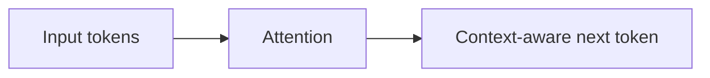

# 부록 2: Transformer attention

[문서 목차로 돌아가기](../README.md)

## 이 문서를 언제 읽나요?

attention이 무엇인지 직관만 잡고 싶을 때 읽습니다.

## 핵심 요약

attention은 model이 이전 token들을 참고해 다음 token을 고르는 데 도움을 주는 구조입니다.

## 쉬운 설명

문장 중 어떤 단어가 중요한지는 상황마다 다릅니다. attention은 현재 token을 만들 때 앞쪽 token 중 무엇을 더 강하게 참고할지 계산합니다.

## 실습과 연결되는 지점

이 개념을 몰라도 실습 2와 실습 3을 진행할 수 있습니다. 다만 긴 prompt가 왜 더 많은 계산을 요구하는지 이해할 때 도움이 됩니다.

## 관련 문서

[부록 3: Prefill과 decode](03_prefill_decode.md)
