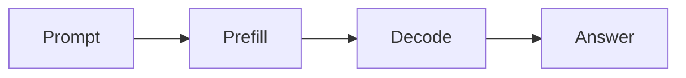

# 부록 3: Prefill과 decode

[문서 목차로 돌아가기](../README.md)

## 이 문서를 언제 읽나요?

benchmark 결과를 보면서 prompt 길이와 생성 길이가 왜 다르게 영향을 주는지 알고 싶을 때 읽습니다.

## 핵심 요약

LLM serving은 크게 prefill과 decode로 나눠 생각할 수 있습니다.

- Prefill: prompt를 읽는 단계
- Decode: 새 token을 생성하는 단계

## 쉬운 설명

긴 prompt는 prefill 비용을 키웁니다. 긴 답변은 decode 비용을 키웁니다.

## 실습과 연결되는 지점

- 실습 4의 `DEFAULT_MAX_TOKENS`는 decode 길이에 영향을 줍니다.
- 실습 5의 prompt preset은 prefill 부담을 비교하는 데 사용합니다.

## 관련 문서

[실습 5: 로컬 benchmark](../labs/05_local_benchmark.md)
