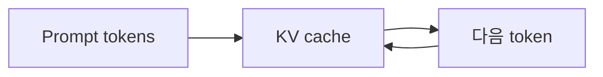

# 부록 4: KV cache

[문서 목차로 돌아가기](../README.md)

## 이 문서를 언제 읽나요?

실습 6의 prefix caching을 이해하기 전에 KV cache의 역할을 간단히 알고 싶을 때 읽습니다.

## 핵심 요약

KV cache는 이미 계산한 attention 관련 정보를 저장해 다음 token 생성에서 재사용합니다.

## 쉬운 설명

모델이 답변을 만들 때 매번 처음부터 모든 것을 다시 계산하면 비효율적입니다. KV cache는 이전 token에서 계산한 정보를 저장해 다음 token 생성에 활용합니다.

## 실습과 연결되는 지점

실습 6의 prefix caching은 반복되는 prompt 앞부분을 재사용할 수 있는 상황에서 효과를 확인합니다.

## 관련 문서

[실습 6: Prefix caching](../labs/06_prefix_caching.md)
