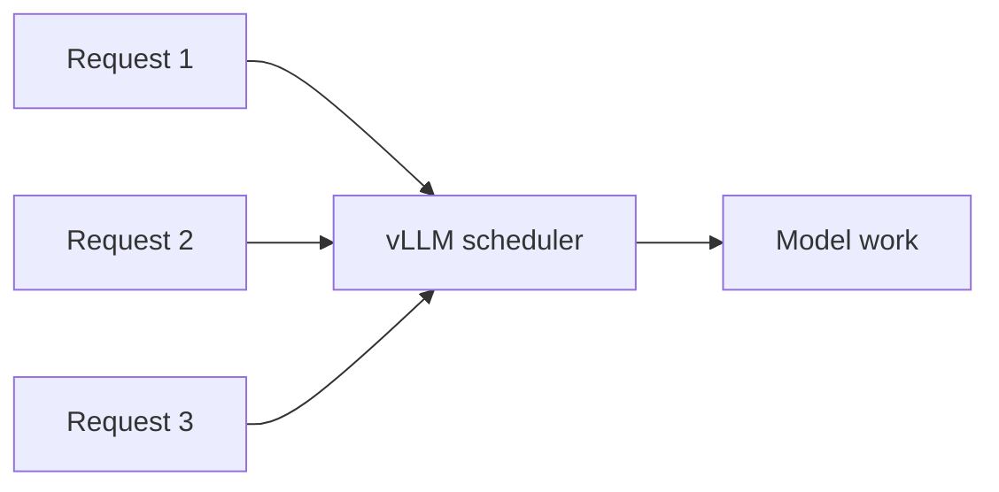

# 부록 5: Batching

[문서 목차로 돌아가기](../README.md)

## 이 문서를 언제 읽나요?

benchmark에서 request rate나 concurrency를 바꿀 때 server가 여러 요청을 어떻게 다루는지 감을 잡고 싶을 때 읽습니다.

## 핵심 요약

Batching은 여러 request를 server가 함께 처리하도록 묶는 방식입니다.

## 쉬운 설명

한 번에 request 하나만 처리하면 GPU를 충분히 활용하지 못할 수 있습니다. serving engine은 여러 요청을 스케줄링해 더 효율적으로 처리하려고 합니다.

## 실습과 연결되는 지점

실습 5에서 `BENCHMARK_REQUEST_RATE`와 `BENCHMARK_MAX_CONCURRENCY`를 바꿔 보며 결과를 비교합니다.

## 관련 문서

- [실습 5: 로컬 benchmark](../labs/05_local_benchmark.md)
- 더 깊이: [심화 3: 배치와 스케줄링](../deep-dive/03_batching_and_scheduling.md)
