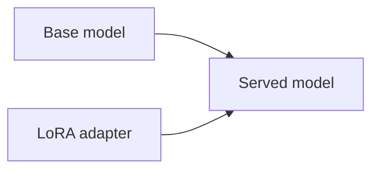

# 부록 7: LoRA와 QLoRA

[문서 목차로 돌아가기](../README.md)

## 이 문서를 언제 읽나요?

실습 7에서 LoRA adapter를 serving한다는 말이 무엇인지 배경만 알고 싶을 때 읽습니다.

## 핵심 요약

LoRA adapter는 base model에 덧붙여 사용하는 작은 추가 weight입니다.

## 쉬운 설명

큰 base model 전체를 새로 학습하지 않고, adapter 형태의 작은 weight를 붙여 특정 용도에 맞춘 동작을 추가할 수 있습니다.

## 실습과 연결되는 지점

이 프로젝트는 LoRA training을 다루지 않습니다. 이미 준비된 adapter를 vLLM serving에 연결하는 흐름만 다룹니다.

## 관련 문서

- [실습 7: LoRA serving](../labs/07_lora_serving.md)
- 더 깊이: [심화 9: LoRA와 QLoRA](../deep-dive/09_lora_and_qlora.md)
