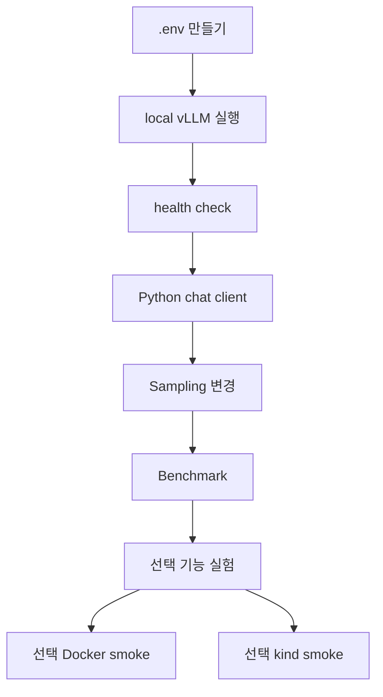

# 부록 8: Mermaid 요약

[문서 목차로 돌아가기](../README.md)

## 이 문서를 언제 읽나요?

전체 학습 흐름을 그림으로 다시 보고 싶을 때 읽습니다.

## 전체 흐름

## 읽는 법

처음에는 `A → B → C → D`까지만 성공해도 충분합니다. 그 다음 sampling과 benchmark로 설정을 바꿔 보고, 마지막에 선택 기능과 smoke test를 확인합니다.

## 관련 문서

[문서 목차](../README.md)
