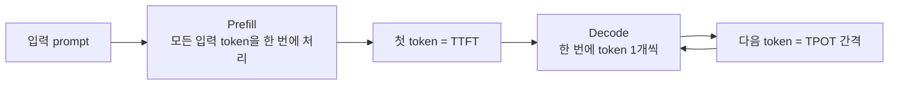

# 심화 1: 추론 성능 지표 (TTFT, TPOT, throughput)

[전체 목차](../README.md) | [deep-dive 목차](00_index.md) | 다음: [KV cache와 PagedAttention](02_kv_cache_and_paged_attention.md)

## 이 문서를 언제 읽나요?

[실습 5: 로컬 benchmark](../labs/05_local_benchmark.md)에서 `latency`와 `throughput` 숫자를 본 뒤,
"이 숫자들이 정확히 무엇을 의미하고, 어떤 조건에서 좋아지는가"를 이해하고 싶을 때 읽습니다.

## 핵심 요약

LLM serving 성능은 단일 숫자가 아니라 **지연 시간(latency) 계열**과 **처리량(throughput) 계열**로
나눠 봐야 합니다. 둘은 자주 서로 trade-off 관계입니다.

## 지표 한눈에 보기

| 지표 | 정식 명칭 | 의미 | 무엇에 민감한가 |
|---|---|---|---|
| TTFT | Time To First Token | 요청을 보낸 뒤 **첫 token**이 나올 때까지 | prefill 단계, prompt 길이 |
| TPOT | Time Per Output Token | 첫 token 이후 **token 1개당 평균 생성 시간** | decode 단계, 메모리 대역폭 |
| ITL | Inter-Token Latency | 연속한 두 token 사이 간격 (TPOT과 거의 같은 개념) | decode 단계, 배치 상황 |
| Latency | End-to-end latency | 요청 전체가 끝날 때까지 걸린 시간 | TTFT + (생성 token 수 × TPOT) |
| Throughput | 처리량 | 초당 처리한 token 또는 요청 수 (tok/s, req/s) | 배치 크기, 동시성 |

대략적인 관계식은 다음과 같습니다.

```
요청 latency ≈ TTFT + (생성 token 수 - 1) × TPOT
```

즉 **짧은 답변**은 TTFT가, **긴 답변**은 TPOT가 전체 시간을 지배합니다.

## 왜 prefill과 decode를 나눠 보나요?

한 번의 생성은 성격이 다른 두 단계로 이뤄집니다. (입문 개념은 [부록 3](../appendix/03_prefill_decode.md) 참고)



- **Prefill**: 입력 전체를 병렬로 계산합니다. 행렬 곱이 크고 GPU 연산 장치를 가득 채우기 쉬워
  보통 **compute-bound**(연산 한계)입니다. 그래서 TTFT는 prompt가 길수록 늘어납니다.
- **Decode**: token을 하나씩 만들며 매 단계 KV cache 전체를 다시 읽습니다. 연산량은 작지만
  메모리에서 읽어오는 양이 많아 보통 **memory-bound**(메모리 대역폭 한계)입니다.
  그래서 TPOT는 모델 크기와 메모리 속도에 민감합니다.

이 구분이 중요한 이유: **TTFT를 줄이는 기법**(chunked prefill, prefix caching)과
**TPOT를 줄이는 기법**(speculative decoding, 더 빠른 KV 접근)은 서로 다릅니다.
뒤따르는 심화 문서들이 각각 어느 쪽을 공략하는지 이 틀로 이해하면 됩니다.

## throughput과 latency는 자주 trade-off

요청을 더 많이 모아 한 배치로 처리하면(동시성↑) GPU를 더 알차게 써서 **throughput은 올라가지만**,
각 요청은 다른 요청과 자원을 나눠 쓰므로 **개별 latency(특히 TPOT)는 나빠질 수 있습니다.**
"빠른 응답"이 목표인지 "많은 처리"가 목표인지에 따라 튜닝 방향이 달라집니다.
(배치가 어떻게 이 둘을 동시에 끌어올리려 하는지는 [심화 3](03_batching_and_scheduling.md)에서 다룹니다.)

## 이 프로젝트의 코드와 연결되는 지점

이 랩의 측정은 `src/vllm_lab/benchmark.py`의 `run_benchmark()`에 있습니다. 핵심만 보면:

```python
def send_request(index: int) -> tuple[float, int]:
    started = time.perf_counter()
    response = active_client.chat.completions.create(
        model=config.default_model,
        messages=[{"role": "user", "content": f"{prompt}\n\nRun: {index + 1}"}],
        temperature=config.default_temperature,
        top_p=config.default_top_p,
        max_tokens=active_max_tokens,
    )
    elapsed = time.perf_counter() - started
    completion_tokens = int(getattr(usage, "completion_tokens", 0) or 0)
    return elapsed, completion_tokens
```

읽을 때 주의할 점:

- 여기서 측정하는 `elapsed`는 **요청 전체의 end-to-end latency**입니다. TTFT/TPOT를 따로 분리하지
  않습니다. (streaming을 쓰지 않으므로 "첫 token 시점"을 알 수 없습니다.) 즉 이 랩의 `Avg Latency`는
  위 표의 `Latency`에 해당합니다.
- throughput 계산은 다음과 같습니다.

```python
total_latency = sum(latencies)          # 각 요청 latency의 "합"
throughput = generated_tokens / total_latency
```

  `total_latency`가 벽시계 시간이 아니라 **요청별 latency의 합**이라는 점이 중요합니다.
  요청은 `ThreadPoolExecutor(max_workers=active_max_concurrency)`로 동시에 실행되어 실제로는
  시간이 겹치므로, 이 `throughput` 값은 "시스템 전체의 실시간 처리량"이라기보다
  **직렬로 환산한 token 생성률**에 가깝습니다. 절대치보다 **설정을 바꿨을 때의 상대 비교**로 쓰세요.

요청 속도는 `1 / request_rate` 간격으로 제출됩니다.

```python
delay_seconds = 1 / active_request_rate if active_request_rate > 0 else 0
```

관련 환경 변수(`.env`)는 다음과 같습니다.

```env
BENCHMARK_NUM_PROMPTS=20
BENCHMARK_REQUEST_RATE=2
BENCHMARK_MAX_CONCURRENCY=4
BENCHMARK_MAX_TOKENS_LIST=64,128,256
```

## 신뢰할 수 있게 측정하기

작은 로컬 환경일수록 측정 noise가 큽니다. 다음을 지키면 숫자가 안정됩니다.

- **warm-up을 버린다**: 첫 요청은 모델 로드·컴파일·캐시 준비가 섞여 느립니다. 첫 1~2개 결과는 참고만.
- **반복해서 본다**: 한 번의 숫자보다 여러 번 돌린 추세를 봅니다.
- **한 번에 하나만 바꾼다**: `max_tokens`, `request_rate`, `prefix_cache`를 동시에 바꾸면 원인을 못 가립니다.
  matrix 실행(`scripts/run_benchmark_matrix.py`)이 이 조합을 자동으로 돌려 표로 정리해 줍니다.
- **환경을 적는다**: CPU/GPU, 모델 profile, dtype을 함께 기록해야 나중에 비교가 됩니다.
  ([실습 5 보고서 템플릿](../labs/05_benchmark_report_template.md) 활용)

## 직접 해보기

`.env`에서 `BENCHMARK_MAX_TOKENS_LIST`를 `32,256`처럼 크게 벌려 matrix를 돌려 보세요.

```bash
uv run python scripts/run_benchmark_matrix.py
```

`max_tokens`가 커질수록 평균 latency가 늘어나는데, 이는 위의 `latency ≈ TTFT + 생성수 × TPOT`에서
"생성 token 수"가 늘기 때문입니다. 같은 throughput이라도 latency가 어떻게 달라지는지 관찰하세요.

## 관련 문서

- 입문: [부록 3: Prefill과 decode](../appendix/03_prefill_decode.md)
- 실습: [실습 5: 로컬 benchmark](../labs/05_local_benchmark.md)
- 다음 심화: [KV cache와 PagedAttention](02_kv_cache_and_paged_attention.md), [배치와 스케줄링](03_batching_and_scheduling.md)
