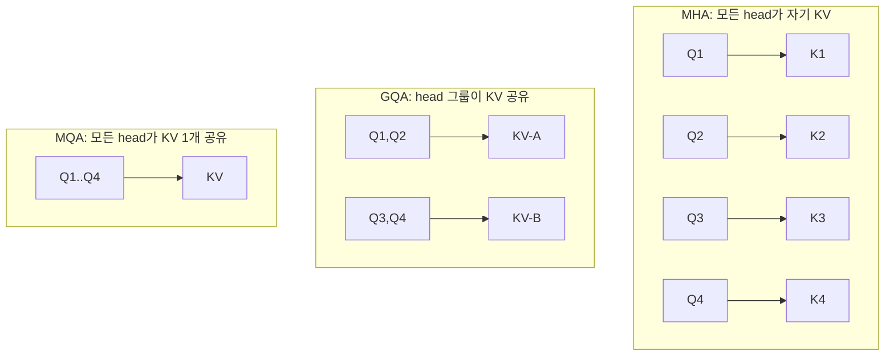
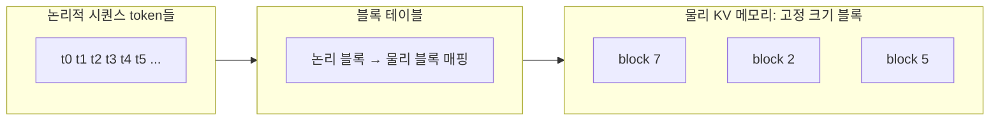

# 심화 2: KV cache와 PagedAttention

[전체 목차](../README.md) | [deep-dive 목차](00_index.md) | 이전: [추론 성능 지표](01_inference_metrics.md) | 다음: [배치와 스케줄링](03_batching_and_scheduling.md)

## 이 문서를 언제 읽나요?

[부록 4: KV cache](../appendix/04_kv_cache.md)로 "왜 캐시가 필요한지" 감을 잡은 뒤,
"KV cache가 메모리를 얼마나 먹고, vLLM은 그걸 어떻게 관리하는가"를 알고 싶을 때 읽습니다.
[실습 6: Prefix caching](../labs/06_prefix_caching.md)과 [심화 4](04_prefix_caching_internals.md)의 토대가 됩니다.

## 핵심 요약

KV cache는 decode 속도를 위해 꼭 필요하지만 **메모리를 많이 차지**합니다.
vLLM의 핵심 기여인 **PagedAttention**은 이 KV cache를 운영체제의 가상 메모리처럼
**고정 크기 블록 단위로 관리**해 메모리 낭비를 거의 없앱니다.

## 1. KV cache가 필요한 이유 (복습)

Transformer의 attention은 각 token이 **이전 모든 token의 Key(K)·Value(V)**를 참조합니다.
KV cache가 없으면 token을 하나 만들 때마다 앞 token들의 K·V를 처음부터 다시 계산해야 합니다.
KV cache는 한 번 계산한 K·V를 저장해 두고 decode 단계에서 재사용합니다.

대신 이 캐시는 **시퀀스가 길어질수록, 동시 요청이 많을수록 선형으로 커집니다.**

## 2. KV cache 메모리 계산식

한 token이 차지하는 KV cache 크기는 다음과 같습니다.

```
token 1개당 KV 바이트
  = 2 (K와 V)
  × num_layers           (트랜스포머 층 수)
  × num_kv_heads         (KV head 수 — GQA/MQA면 query head보다 작음)
  × head_dim             (head 하나의 차원)
  × dtype_bytes          (float16=2, float32=4)
```

전체는 여기에 **시퀀스 길이 × 동시 시퀀스 수**를 곱합니다.

```
총 KV cache ≈ (token 1개당 바이트) × seq_len × num_sequences
```

### 작은 모델로 직접 계산해 보기

이 랩의 기본 profile 중 하나인 `Qwen2.5-0.5B-Instruct`(이 랩 `MODEL_TINY`)를 예로 듭니다.
(대략적인 구성: layers 24, KV heads 2(GQA), head_dim 64, float16)

```
token 1개당 = 2 × 24 × 2 × 64 × 2 bytes = 24,576 bytes ≈ 24 KB

max-model-len = 4096 token, 시퀀스 1개라면
  24 KB × 4096 ≈ 96 MB  (시퀀스 하나 가득 채울 때)
```

작은 모델이라 시퀀스당 ~100MB지만, **7B급 모델에 GQA가 없으면 시퀀스당 수 GB**까지 쉽게 커집니다.
이것이 이 랩이 [`configs/models.small.toml`](../../configs/models.small.toml)에서 작은 모델부터
시작하도록 권하는 이유입니다.

> `.env`의 `DEFAULT_MAX_MODEL_LEN`을 줄이면 (예: Apple Silicon 예시의 `512`)
> 시퀀스당 KV cache 상한이 그만큼 작아져 메모리 부족을 피할 수 있습니다.

## 3. GQA / MQA — KV를 줄이는 구조

KV cache 크기는 위 식에서 `num_kv_heads`에 비례합니다. 그래서 최신 모델은 KV head 수를 줄입니다.



| 방식 | KV head 수 | KV cache 크기 | 품질/속도 |
|---|---|---|---|
| MHA (Multi-Head Attention) | query head와 동일 | 가장 큼 | 품질 기준선 |
| GQA (Grouped-Query Attention) | query head보다 적음(그룹) | 중간 | 품질 거의 유지하며 절감 |
| MQA (Multi-Query Attention) | 1 | 가장 작음 | 가장 절감, 품질 약간 손해 |

위 0.5B 예시에서 KV head가 2였던 것이 GQA 덕분입니다. 만약 query head 수만큼(예: 14) 썼다면
KV cache가 7배 커졌을 것입니다. **GQA/MQA는 모델을 고를 때 이미 정해져 있으며**, 같은 파라미터 수라도
KV head가 적은 모델이 긴 컨텍스트·높은 동시성에 유리합니다.

## 4. PagedAttention — KV cache를 페이지로 관리

### 문제: 연속 할당의 낭비

순진하게 구현하면 각 요청마다 "최대 길이"만큼 KV cache를 **연속된 메모리로 미리** 잡아야 합니다.
하지만 실제 생성 길이는 요청마다 다르므로,

- 짧게 끝난 요청은 잡아둔 공간 대부분을 **낭비**하고(internal fragmentation),
- 큰 연속 공간을 못 찾아 메모리가 남아도 요청을 **거절**하는(external fragmentation) 일이 생깁니다.

### 해결: 고정 크기 블록 + 매핑 테이블

PagedAttention은 OS의 가상 메모리(paging)에서 아이디어를 빌립니다.



- KV cache를 **고정 크기 블록**(예: token 16개분)으로 쪼갭니다.
- 각 시퀀스는 "논리 블록 → 물리 블록" **매핑 테이블**만 갖습니다. 물리 블록은 메모리 어디에 흩어져 있어도 됩니다.
- 필요할 때 블록을 **그때그때 할당**하므로 미리 최대치를 잡지 않습니다 → 낭비가 거의 사라집니다.
- 여러 시퀀스가 **같은 물리 블록을 가리킬 수 있습니다.** 이것이 prefix를 공유하는 기반이며
  [심화 4: Prefix caching 내부 동작](04_prefix_caching_internals.md)으로 이어집니다.

이 "블록을 공유한다"는 성질은 [심화 5: speculative decoding](05_speculative_decoding.md)의
병렬 후보 검증에서도 메모리 효율의 토대가 됩니다.

## 이 프로젝트와 연결되는 지점

- 모델 선택이 곧 KV head 구조 선택입니다. [`configs/models.small.toml`](../../configs/models.small.toml)의
  profile들은 모두 GQA를 쓰는 작은 모델이라 로컬에서 KV cache 부담이 작습니다.
- `.env`의 `DEFAULT_MAX_MODEL_LEN`은 시퀀스당 KV cache 상한을 정합니다. 메모리 부족(OOM) 시
  가장 먼저 줄여 볼 값입니다. ([문제 해결](../setup/07_troubleshooting.md))
- Docker/k8s에서 CPU 백엔드의 KV cache 공간은 `VLLM_CPU_KVCACHE_SPACE`(이 랩의
  `DOCKER_CPU_KVCACHE_SPACE`/`K8S_CPU_KVCACHE_SPACE`)로 따로 잡습니다.

## 관련 문서

- 입문: [부록 4: KV cache](../appendix/04_kv_cache.md)
- 실습: [실습 6: Prefix caching](../labs/06_prefix_caching.md)
- 다음 심화: [배치와 스케줄링](03_batching_and_scheduling.md), [Prefix caching 내부 동작](04_prefix_caching_internals.md)
