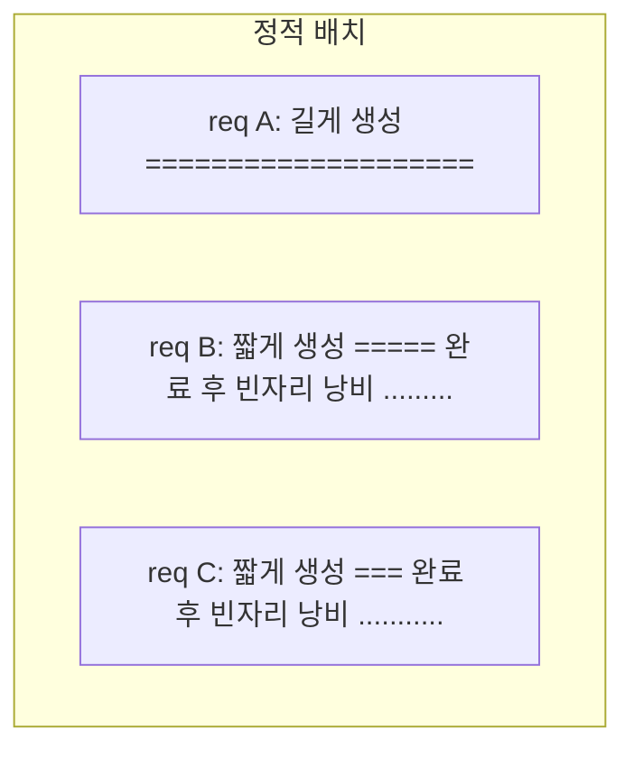
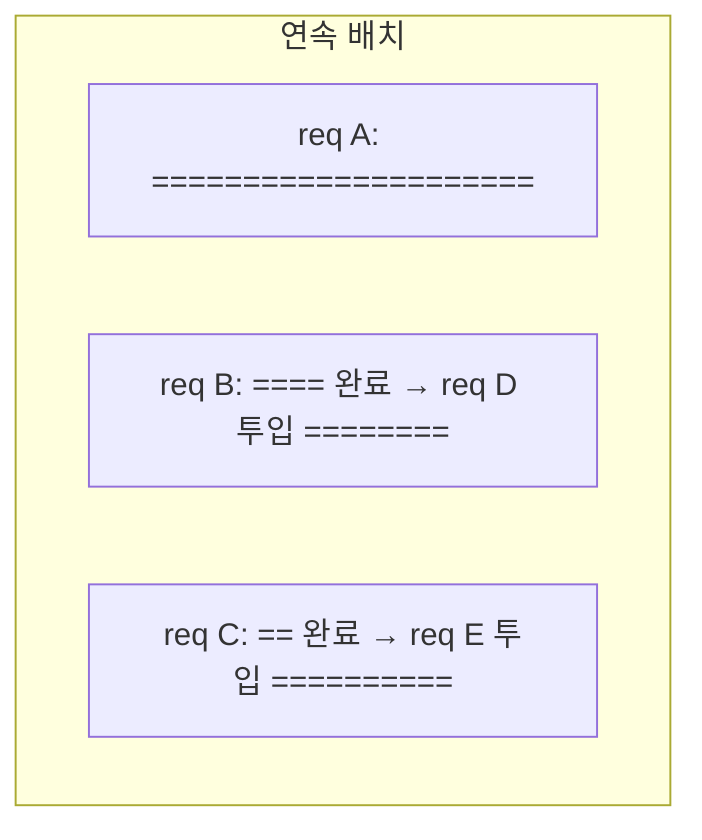
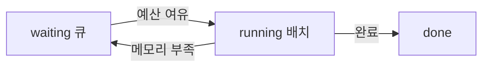

# 심화 3: 배치와 스케줄링 (continuous batching, chunked prefill)

[전체 목차](../README.md) | [deep-dive 목차](00_index.md) | 이전: [KV cache와 PagedAttention](02_kv_cache_and_paged_attention.md) | 다음: [Prefix caching 내부 동작](04_prefix_caching_internals.md)

## 이 문서를 언제 읽나요?

[부록 5: Batching](../appendix/05_batching.md)으로 "여러 요청을 모아 처리한다"는 감을 잡은 뒤,
vLLM이 **어떤 규칙으로** 요청을 묶고, 어떤 설정으로 그 동작을 바꿀 수 있는지 알고 싶을 때 읽습니다.
[실습 5: 로컬 benchmark](../labs/05_local_benchmark.md)에서 `request_rate`와 `max_concurrency`를
바꿔 본 결과를 해석하는 데 도움이 됩니다.

## 핵심 요약

GPU는 "한 요청을 빠르게"보다 "여러 요청을 한꺼번에" 처리할 때 효율이 좋습니다.
vLLM은 **연속 배치(continuous batching)**로 매 step마다 배치 구성을 다시 짜고,
**chunked prefill**로 긴 prompt가 다른 요청을 막지 않게 합니다. 이 동작은
`max_num_seqs`, `max_num_batched_tokens`, `gpu_memory_utilization`로 조절합니다.

## 1. 정적 배치 vs 연속 배치

### 정적 배치 (static batching)

요청들을 한 묶음으로 시작하고, **그 배치의 모든 요청이 끝날 때까지** 다음 배치를 시작하지 않습니다.



문제: 짧게 끝난 요청의 자리가 **배치가 끝날 때까지 비어 있습니다.** 길이가 제각각인 LLM 생성에서는 낭비가 큽니다.

### 연속 배치 (continuous batching)

vLLM은 **token 생성 step 단위**로 배치를 다시 구성합니다. 끝난 요청은 즉시 빠지고, 대기 중이던
새 요청이 **그 자리를 바로 채웁니다.**



효과: GPU의 빈자리를 계속 메워 **throughput이 크게 올라갑니다.** 이것이 vLLM이 기본으로 쓰는 방식입니다.

## 2. 스케줄러와 token 예산

매 step마다 스케줄러는 "이번 step에 어떤 요청들을 함께 처리할지"를 두 가지 상한 안에서 정합니다.

- **`max_num_seqs`**: 한 step에 함께 둘 수 있는 **시퀀스(요청) 최대 개수**.
- **`max_num_batched_tokens`**: 한 step에 처리할 수 있는 **token 총량(예산)**.
  prefill 중인 요청의 입력 token과 decode 중인 요청의 token을 모두 합산합니다.

요청이 너무 많거나 KV cache 메모리가 부족하면 일부 요청은 **대기(waiting)** 상태로 미뤄지고,
극단적으로는 이미 진행 중이던 요청이 **선점(preemption)**되어 잠시 밀려나기도 합니다.



## 3. Chunked prefill — 긴 prompt가 길을 막지 않게

prefill은 입력 전체를 한 번에 계산하므로 token 예산을 크게 차지합니다. 아주 긴 prompt 하나가
들어오면, 그 prefill이 끝날 때까지 **decode 중이던 다른 요청들이 멈칫**할 수 있습니다(TTFT는 좋아도
다른 요청의 TPOT가 나빠짐).

chunked prefill은 긴 prefill을 **여러 조각으로 나눠** 매 step에 조금씩 처리하고, 남는 예산으로
decode 요청을 함께 진행합니다. 결과적으로 prefill과 decode가 한 배치에 섞여
**한 요청이 전체를 독점하는 것을 막아** 지연을 고르게 만듭니다.

## 4. 이 랩의 실제 설정으로 보기

이 랩의 Docker 설정([`deploy/docker/docker-compose.yml`](../../deploy/docker/docker-compose.yml))은
**작은 로컬/CPU 환경을 위해 의도적으로 배치를 최소화**합니다.

```yaml
command:
  - --model
  - ${MODEL_DEFAULT:-Qwen/Qwen3-0.6B}
  ...
  - --enforce-eager
  - --max-num-seqs
  - ${DOCKER_MAX_NUM_SEQS:-1}
  - --max-num-batched-tokens
  - ${DOCKER_MAX_NUM_BATCHED_TOKENS:-256}
  - --no-enable-prefix-caching
```

대응하는 `.env` 기본값:

```env
DOCKER_MAX_NUM_SEQS=1
DOCKER_MAX_NUM_BATCHED_TOKENS=256
K8S_MAX_NUM_SEQS=1
K8S_MAX_NUM_BATCHED_TOKENS=256
```

여기서 `max_num_seqs=1`은 "한 번에 요청 1개만" 처리한다는 뜻입니다. 즉 **연속 배치의 이점을 일부러
끄고** 메모리를 아끼는 보수적 설정입니다. CPU 환경에서 안정적으로 "일단 돌아가게" 하는 것이 목표이기 때문입니다.

## 5. 튜닝 가이드

| 설정 | 올리면 | 내리면 | 언제 조절 |
|---|---|---|---|
| `max_num_seqs` | 동시 처리↑, throughput↑, 메모리·TPOT 부담↑ | 메모리 안정, 동시성↓ | GPU 여유가 있고 throughput을 키우고 싶을 때 |
| `max_num_batched_tokens` | 큰 prefill·높은 동시성 처리 여유↑ | 메모리 안정 | 긴 prompt가 많거나 OOM이 날 때 |
| `gpu_memory_utilization` | KV cache로 쓸 GPU 메모리↑(더 많은/긴 요청 수용) | 다른 용도 여유↑ | KV cache가 부족해 요청이 자주 밀릴 때 |

> 핵심 trade-off는 [심화 1](01_inference_metrics.md)에서 본 그대로입니다. 동시성을 키우면 throughput은
> 오르지만 개별 요청의 TPOT는 나빠질 수 있습니다. **로컬에서는 `max_num_seqs`를 1 → 2 → 4로 한 단계씩만**
> 올리며 benchmark로 확인하세요.

## 직접 해보기

GPU 환경이라면 `local_serve_help.py`가 출력한 `vllm serve` 명령에 `--max-num-seqs 4`를 더해 서버를
다시 띄운 뒤, `request_rate`를 올려 동시성을 만들고 throughput 변화를 봅니다.

```bash
uv run python scripts/local_serve_help.py
# 출력 명령 끝에 --max-num-seqs 4 추가하여 실행
```

```env
BENCHMARK_REQUEST_RATE=4
BENCHMARK_MAX_CONCURRENCY=4
```

```bash
uv run python scripts/run_benchmark.py
```

`max_num_seqs=1`일 때와 비교하면, 동시성이 생겼을 때 연속 배치가 throughput을 어떻게 끌어올리는지
관찰할 수 있습니다. (CPU 단일 환경에서는 차이가 작거나 오히려 latency가 늘 수 있습니다.)

## 관련 문서

- 입문: [부록 5: Batching](../appendix/05_batching.md)
- 실습: [실습 5: 로컬 benchmark](../labs/05_local_benchmark.md)
- 함께 보기: [추론 성능 지표](01_inference_metrics.md), [KV cache와 PagedAttention](02_kv_cache_and_paged_attention.md)
