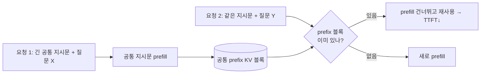

# 심화 4: Prefix caching 내부 동작

[전체 목차](../README.md) | [deep-dive 목차](00_index.md) | 이전: [배치와 스케줄링](03_batching_and_scheduling.md) | 다음: [Speculative decoding](05_speculative_decoding.md)

## 이 문서를 언제 읽나요?

[실습 6: Prefix caching](../labs/06_prefix_caching.md)을 돌려 본 뒤,
"왜 어떤 경우에는 빨라지고 어떤 경우에는 효과가 없었는지"를 원리로 이해하고 싶을 때 읽습니다.
[심화 2: KV cache와 PagedAttention](02_kv_cache_and_paged_attention.md)의 블록 개념을 먼저 보면 이해가 빠릅니다.

## 핵심 요약

Automatic Prefix Caching(APC)은 **여러 요청이 공유하는 prompt 앞부분(prefix)의 KV cache를
다시 계산하지 않고 재사용**하는 기능입니다. prefix가 같으면 그 부분의 prefill을 건너뛰어 TTFT를 줄입니다.
단, **공유되는 prefix가 충분히 길고 자주 반복될 때만** 이득입니다.

## 1. 무엇을 캐싱하나요?

캐싱하는 것은 출력 텍스트가 아니라 **prompt의 KV cache(계산 결과)**입니다.
[심화 1](01_inference_metrics.md)에서 본 prefill 단계의 결과물을 재사용하는 것입니다.



## 2. 블록 해시로 공유 여부를 판단

[심화 2](02_kv_cache_and_paged_attention.md)에서 본 것처럼 vLLM은 KV cache를 고정 크기 블록으로 관리합니다.
APC는 각 블록에 대해 **"그 블록까지의 token 내용으로 만든 해시"**를 키로 둡니다.

- 새 요청이 들어오면 앞에서부터 블록 단위로 해시를 계산합니다.
- 같은 해시의 블록이 이미 캐시에 있으면 → **그 물리 블록을 그대로 가리켜** prefill을 건너뜁니다.
- 해시가 갈라지는 첫 지점부터만 새로 계산합니다.

여기서 두 가지 성질이 나옵니다.

- **접두사(prefix)여야 한다**: token 0부터 연속으로 같아야 같은 해시가 나옵니다. 중간만 같은 것은 공유 안 됩니다.
- **블록 경계 단위로 공유된다**: 공유 길이는 블록 크기(예: 16 token)의 배수로 잘립니다. 1~2 token 겹치는 정도는 보통 효과가 없습니다.

## 3. 언제 이득이고, 언제 아닌가

| 잘 맞는 경우 | 효과가 작은 경우 |
|---|---|
| 긴 system prompt / 지시문을 여러 요청이 공유 | prompt가 매번 거의 다름 |
| few-shot 예시가 고정된 프롬프트 | prefix가 짧음(블록 1개 미만) |
| 같은 문서에 대한 여러 질의(RAG 컨텍스트 재사용) | 요청이 띄엄띄엄 와서 캐시가 밀려남(eviction) |
| 멀티턴 대화에서 앞 대화 재사용 | 동시성·메모리가 작아 캐시가 유지 안 됨 |

캐시도 메모리를 쓰므로, KV cache 공간이 부족하면 오래된 prefix 블록이 **밀려나(eviction)** 재사용 기회를 잃습니다.

## 4. 이 랩의 실측 해석

[실습 6](../labs/06_prefix_caching.md)의 Apple Silicon CPU 소규모 실행에서는 다음 결과가 나왔습니다.

```
prefix_cache=true  → 평균 2.487s
prefix_cache=false → 평균 1.867s
```

즉 **캐시를 켠 쪽이 오히려 느렸습니다.** 이는 prefix caching이 쓸모없다는 뜻이 아니라,
이 측정 조건이 APC가 이득을 내는 조건과 어긋났기 때문입니다.

- 프롬프트가 짧아 **공유되는 prefix가 블록 단위 이득을 낼 만큼 길지 않았습니다.**
- `max_num_seqs=1`의 직렬 처리라 **동시에 같은 prefix를 쓰는 요청이 없었습니다.**(심화 3 참고)
- CPU 환경에서는 prefill 절약 이득보다 **블록 해시 관리 오버헤드**가 상대적으로 커집니다.

이 랩의 Docker 기본값이 `--no-enable-prefix-caching`인 것도 같은 이유입니다(작은 CPU 환경 기준 보수적 선택).

## 이 프로젝트와 연결되는 지점

- 토글은 `.env`의 `ENABLE_PREFIX_CACHING`이며, 켜면 `local_serve_help.py`가 만드는 명령에
  `--enable-prefix-caching`이 붙습니다([`scripts/run_prefix_cache_test.py`](../../scripts/run_prefix_cache_test.py)).

```env
ENABLE_PREFIX_CACHING=true
BENCHMARK_PROMPT_PRESET=long
```

- `BENCHMARK_PROMPT_PRESET=long`은 [`configs/prompts.toml`](../../configs/prompts.toml)의
  긴 프롬프트를 써서 **공유 prefix를 길게** 만들기 위한 설정입니다. APC 효과를 보려면 prefix가 길어야 하기 때문입니다.

## 직접 해보기

효과를 제대로 보려면 (1) **긴 공통 prefix**와 (2) **동시성**이 필요합니다. GPU 환경에서:

```env
ENABLE_PREFIX_CACHING=true
BENCHMARK_PROMPT_PRESET=long
BENCHMARK_REQUEST_RATE=4
```

`run_benchmark.py`를 `true`/`false`로 각각 돌려 `results/benchmarks/latest.md`의 평균 latency를 비교하세요.
공유 prefix가 길수록 `true`의 TTFT 이득이 드러납니다.

## 관련 문서

- 전제 개념: [심화 2: KV cache와 PagedAttention](02_kv_cache_and_paged_attention.md)
- 실습: [실습 6: Prefix caching](../labs/06_prefix_caching.md)
- 함께 보기: [추론 성능 지표](01_inference_metrics.md), [배치와 스케줄링](03_batching_and_scheduling.md)
