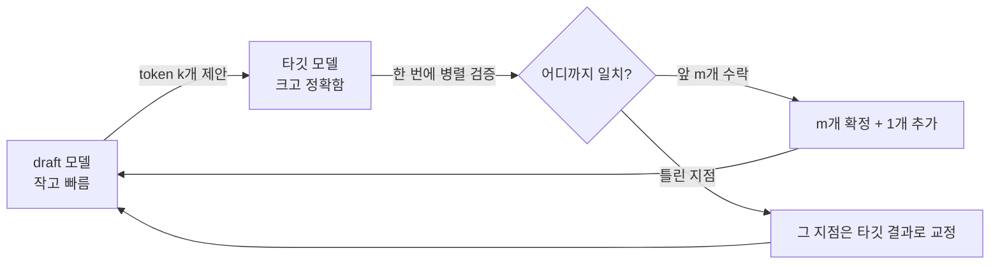

# 심화 5: Speculative decoding

[전체 목차](../README.md) | [deep-dive 목차](00_index.md) | 이전: [Prefix caching 내부 동작](04_prefix_caching_internals.md) | 다음: [멀티 GPU 병렬화](06_multi_gpu_parallelism.md)

## 이 문서를 언제 읽나요?

[실습 8: Speculative decoding](../labs/08_speculative_decoding.md)에서 설정을 비교해 본 뒤,
"작은 모델로 어떻게 큰 모델을 더 빠르게 만드는지, 그리고 왜 항상 빨라지지는 않는지"를
이해하고 싶을 때 읽습니다.

## 핵심 요약

Speculative decoding은 **작고 빠른 draft 모델이 여러 token을 미리 제안**하고,
**크고 정확한 타깃 모델이 그 제안을 한 번에 검증**하는 기법입니다. 검증이 통과되면
한 step에 여러 token을 확정해 decode를 가속합니다. **출력 품질은 타깃 모델 그대로 유지됩니다.**

## 1. 왜 빨라질 수 있나 — decode의 병목

[심화 1](01_inference_metrics.md)에서 본 것처럼 decode는 보통 **memory-bound**입니다.
token 하나를 만들 때 모델 가중치와 KV cache를 메모리에서 읽어오는 비용이 지배적이고,
이때 GPU의 연산 장치는 한가합니다. 즉 **"한 번에 token 1개"는 GPU 연산을 낭비**합니다.

speculative decoding은 이 한가한 연산 여력을 활용합니다. **여러 후보 token을 한 번에 검증**하면,
메모리를 한 번 읽는 비용으로 여러 token을 확정할 수 있습니다.

## 2. 동작 흐름



1. draft 모델이 다음 token을 `k`개 빠르게 제안합니다(`num_speculative_tokens`).
2. 타깃 모델이 그 `k`개를 **한 번의 forward로 병렬 검증**합니다.
3. 앞에서부터 타깃의 분포와 맞는 token까지 **수락**하고, 처음 틀린 자리는 타깃의 정답으로 교정합니다.
4. 수락된 만큼 건너뛰고 다시 반복합니다.

검증이 타깃 모델 기준으로 이뤄지므로 **최종 출력은 타깃 모델 단독으로 생성한 것과 통계적으로 동일**합니다.
속도만 얻고 품질은 잃지 않는다는 것이 핵심입니다.

## 3. acceptance rate가 모든 것을 좌우한다

이득의 크기는 **수락률(acceptance rate)**, 즉 draft의 제안이 타깃에게 받아들여지는 비율에 달렸습니다.

- 수락률이 **높으면**: 한 step에 여러 token 확정 → 큰 가속.
- 수락률이 **낮으면**: 제안이 자꾸 버려져, draft 실행 비용만 추가되고 **오히려 느려질 수 있습니다.**

수락률은 draft 모델이 타깃 모델과 얼마나 비슷하게 예측하느냐에 달려 있습니다. 그래서 보통
**같은 계열의 작은 모델**을 draft로 씁니다(예: 타깃 3B + draft 1B).

### 변형: Medusa

별도 draft 모델 대신, 타깃 모델에 **여러 개의 예측 head**를 붙여 한 번에 여러 미래 token을
스스로 제안하게 하는 방식입니다. 별도 모델을 관리하지 않아도 되지만, 그 head들을 학습시켜야 합니다.
"작은 모델이 제안 → 타깃이 검증"이라는 큰 그림은 같습니다.

## 4. 언제 이득이고, 언제 손해인가

| 이득이 큰 경우 | 손해가 날 수 있는 경우 |
|---|---|
| draft가 타깃과 잘 일치(높은 수락률) | draft 품질이 낮아 수락률이 낮음 |
| decode가 memory-bound인 큰 타깃 모델 | 타깃이 작아 원래도 빠름(가속 여지 적음) |
| 동시성이 낮아 GPU 연산 여력이 남을 때 | 배치가 이미 GPU 연산을 꽉 채운 고throughput 상황 |
| GPU 환경 | CPU 환경(병렬 검증 이점이 약함) |

마지막 두 줄이 중요합니다. **이미 연속 배치로 GPU가 포화**([심화 3](03_batching_and_scheduling.md))거나
**CPU 환경**이면, speculative decoding의 "남는 연산 활용" 전제가 무너져 이득이 줄거나 사라집니다.

## 이 프로젝트와 연결되는 지점

이 랩에서 speculative decoding은 `.env`로 토글합니다([`scripts/run_speculative_test.py`](../../scripts/run_speculative_test.py)).

```env
ENABLE_SPECULATIVE_DECODING=true
SPECULATIVE_CONFIG_JSON={"model": "Qwen/Qwen2.5-0.5B-Instruct", "num_speculative_tokens": 5}
```

`run_speculative_test.py`는 이 설정이 켜져 있는지 확인하고, 설정한 config를 출력하며
"이 config로 vLLM을 다시 시작한 뒤 `run_benchmark.py`로 비교하라"고 안내합니다.

```python
if not settings.enable_speculative_decoding:
    print("ENABLE_SPECULATIVE_DECODING=false")
    ...
print("다음 speculative config로 vLLM을 다시 시작하세요:")
print(settings.speculative_config_json)
```

여기서 `model`이 draft 모델, `num_speculative_tokens`가 위의 제안 개수 `k`입니다.
draft로는 타깃과 같은 계열의 더 작은 모델(예: 타깃이 `Qwen2.5-3B`면 draft `Qwen2.5-0.5B`)을 고릅니다.

## 직접 해보기

GPU 환경에서 타깃을 `balanced`(3B)로, draft를 `tiny`(0.5B)로 두고 baseline과 비교하세요.

1. `ENABLE_SPECULATIVE_DECODING=false`로 baseline benchmark 실행
2. 위 `.env` 설정으로 켠 뒤 동일 조건 benchmark 실행
3. `results/benchmarks/latest.md`의 평균 latency 비교

수락률이 낮으면 baseline보다 느릴 수 있습니다. 이는 실패가 아니라 **draft·타깃 궁합과 환경**이
이 기법의 전제와 맞는지 확인하는 실험입니다. ([실습 8](../labs/08_speculative_decoding.md)의 baseline 비교표 참고)

## 관련 문서

- 전제 개념: [추론 성능 지표](01_inference_metrics.md)(memory-bound decode), [배치와 스케줄링](03_batching_and_scheduling.md)
- 실습: [실습 8: Speculative decoding](../labs/08_speculative_decoding.md)
