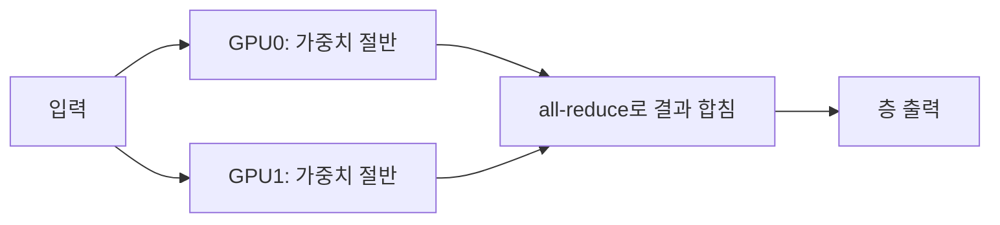

# 심화 6: 멀티 GPU 병렬화 (tensor / pipeline parallel)

[전체 목차](../README.md) | [deep-dive 목차](00_index.md) | 이전: [Speculative decoding](05_speculative_decoding.md) | 다음: [vLLM 엔진 아키텍처](07_vllm_engine_architecture.md)

## 이 문서를 언제 읽나요?

"모델이 GPU 한 장에 안 들어가면 어떻게 하나", "GPU를 여러 장 쓰면 무조건 빨라지나"가 궁금할 때 읽습니다.
이 랩은 로컬 단일 GPU/CPU를 기본으로 하므로 이 문서는 **개념 이해와 클라우드 확장 대비**가 목적입니다.

## 핵심 요약

GPU 한 장에 모델이 안 들어가거나 더 빠른 처리가 필요할 때 여러 GPU에 모델을 나눕니다.
대표 방식은 **Tensor Parallel(TP)**(한 층을 여러 GPU가 쪼개 동시 계산)과
**Pipeline Parallel(PP)**(층들을 GPU별로 나눠 단계적으로 처리)입니다.
병렬화는 공짜가 아니라 **GPU 간 통신 비용**을 동반합니다.

## 1. 왜 나누나요?

두 가지 동기가 있습니다.

- **용량(capacity)**: 모델 가중치 + KV cache가 GPU 한 장의 메모리(VRAM)를 초과하면 나눠 담아야 합니다.
- **속도(speed)**: 여러 GPU가 동시에 계산하면 throughput과 latency를 개선할 수 있습니다(통신비를 넘는 한).

## 2. Tensor Parallel (TP)

각 트랜스포머 층의 **큰 행렬 연산을 여러 GPU가 열/행으로 쪼개** 동시에 계산하고, 결과를 합칩니다.

- 장점: **한 층의 지연**을 줄여 latency·throughput 모두 도움. 큰 모델을 메모리에 나눠 담기에 좋음.
- 비용: **매 층마다 GPU 간 통신**(all-reduce)이 일어납니다. 그래서 GPU들이 빠른 인터커넥트
  (예: NVLink, 같은 노드 안)로 묶여 있어야 효율이 납니다. 노드를 넘는 TP는 통신비로 손해 보기 쉽습니다.

이 랩과 강의의 `-tp 2`(`--tensor-parallel-size 2`)가 바로 TP이며, "GPU 2장으로 나눠 추론"을 뜻합니다.

## 3. Pipeline Parallel (PP)

모델의 **층들을 GPU별로 구간 분할**합니다. GPU0이 앞쪽 층, GPU1이 뒤쪽 층을 맡고,
데이터가 컨베이어벨트처럼 흘러갑니다.

- 장점: GPU 간 통신이 **구간 경계에서만** 일어나 통신량이 TP보다 적습니다. 노드를 넘는 확장에 상대적으로 유리.
- 비용: 단순하게 쓰면 한 GPU가 일할 때 다른 GPU가 노는 **버블(bubble)**이 생깁니다.
  요청을 여러 micro-batch로 잘게 흘려 이 빈틈을 메웁니다.

| 구분 | Tensor Parallel | Pipeline Parallel |
|---|---|---|
| 나누는 대상 | 한 층 내부의 행렬 | 층들을 구간으로 |
| 통신 빈도 | 매 층(많음) | 구간 경계(적음) |
| 적합 환경 | 빠른 인터커넥트의 같은 노드 | 노드 간 확장 |
| 주의점 | 통신 대역폭 | 파이프라인 버블 |

실전에서는 둘을 **함께** 씁니다(노드 안은 TP, 노드 간은 PP).

## 4. 병렬화는 공짜가 아니다

GPU를 2배로 늘려도 속도가 2배가 되지는 않습니다(통신·동기화 오버헤드). 그래서 순서는 항상:

1. **먼저 단일 GPU에서 최적화**한다 — 양자화로 모델을 줄이고, [심화 3](03_batching_and_scheduling.md)의
   `gpu_memory_utilization`·`max_num_seqs`를 조절한다.
2. 그래도 **모델이 안 들어가거나** 단일 GPU throughput이 한계일 때 비로소 병렬화를 고려한다.

작은 모델을 단일 GPU로 충분히 돌릴 수 있다면 TP/PP는 오히려 통신비 때문에 손해입니다.

## 이 프로젝트와 연결되는 지점

- 이 랩의 기본 경로(로컬 단일 GPU/CPU, Docker, kind)는 **병렬화를 쓰지 않습니다.** Docker/k8s 설정은
  `--max-num-seqs 1` 같은 단일·보수적 값입니다([`deploy/docker/docker-compose.yml`](../../deploy/docker/docker-compose.yml)).
- 멀티 GPU는 보통 클라우드 GPU 인스턴스에서 의미가 있습니다. 그때 `vllm serve ... --tensor-parallel-size N`
  형태로 적용하며, 나머지 워크플로(헬스 체크·client 호출·benchmark)는 이 랩 스크립트를 그대로 재사용할 수 있습니다.
- 즉 이 문서는 "지금 당장 실행"이 아니라 **로컬에서 익힌 개념을 멀티 GPU로 확장할 때의 지도**입니다.

## 관련 문서

- 함께 보기: [배치와 스케줄링](03_batching_and_scheduling.md), [KV cache와 PagedAttention](02_kv_cache_and_paged_attention.md)
- 실습(단일 환경 측정): [실습 5: 로컬 benchmark](../labs/05_local_benchmark.md)
