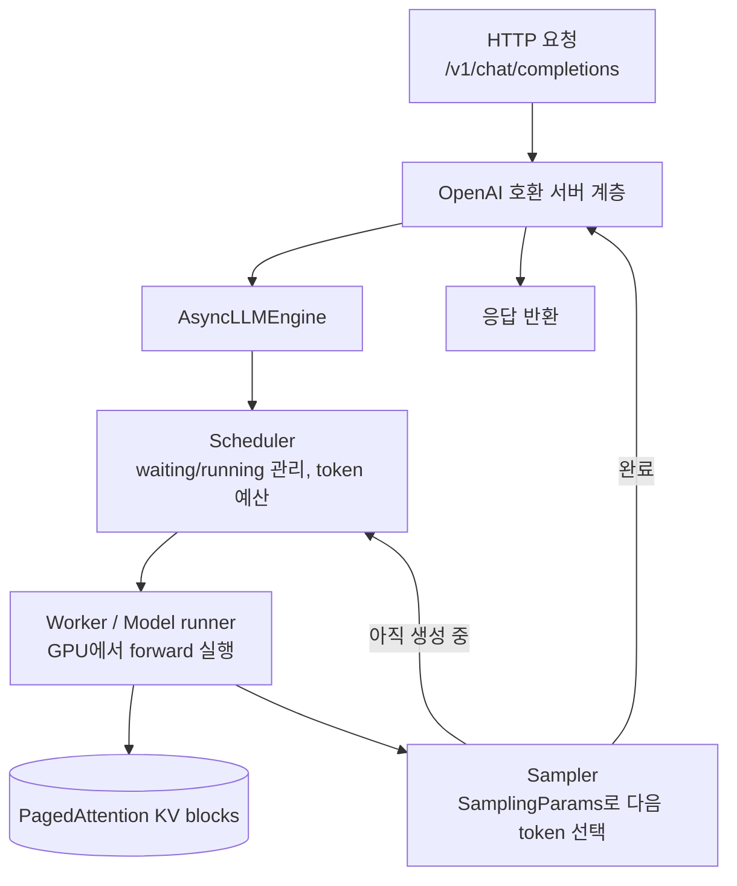

# 심화 7: vLLM 엔진 아키텍처

[전체 목차](../README.md) | [deep-dive 목차](00_index.md) | 이전: [멀티 GPU 병렬화](06_multi_gpu_parallelism.md)

## 이 문서를 언제 읽나요?

[실습 2: 로컬 vLLM 서버 실행](../labs/02_local_first_server.md)과
[실습 3: 첫 Python client 호출](../labs/03_first_python_client.md)을 해본 뒤,
"`vllm serve`와 `LLM(...)`은 안에서 어떻게 다르고, 내 요청이 token이 되어 돌아오기까지 어떤
부품을 거치는가"를 알고 싶을 때 읽습니다. 앞선 심화 문서들(배치·KV cache·캐싱·가속)이 **어느 부품에서**
작동하는지 하나로 꿰는 문서입니다.

## 핵심 요약

vLLM은 **세 계층**으로 볼 수 있습니다. 가장 안쪽 `LLMEngine`(스케줄링·실행의 심장),
이를 감싼 사용 인터페이스(`LLM` = 오프라인 배치 / `AsyncLLMEngine` = 비동기 서버),
그리고 그 위의 **OpenAI 호환 HTTP 서버**입니다. 이 랩은 서버를 띄우고 OpenAI client로 호출합니다.

## 1. 두 가지 사용 방식

| 방식 | 진입점 | 쓰는 상황 | 이 랩의 예 |
|---|---|---|---|
| 오프라인 배치 | `from vllm import LLM` | 프롬프트 묶음을 한 번에 처리, 서버 불필요 | `scripts/offline_generate.py` |
| 온라인 서빙 | `vllm serve ...` (HTTP 서버) | 여러 client가 실시간 호출 | `local_serve_help.py` + `call_chat.py` |

둘 다 내부적으로는 **같은 `LLMEngine`**을 씁니다. 차이는 "감싸는 껍데기"뿐입니다.

### 오프라인 경로 (이 랩의 `offline_generate.py`)

```python
from vllm import LLM, SamplingParams

llm = LLM(model=settings.default_model, dtype=settings.default_dtype)
params = SamplingParams(
    temperature=settings.default_temperature,
    top_p=settings.default_top_p,
    max_tokens=settings.default_max_tokens,
)
outputs = llm.generate(["Explain vLLM in one simple sentence."], params)
print(outputs[0].outputs[0].text)
```

`LLM`은 `LLMEngine`을 동기적으로 감싼 것입니다. `SamplingParams`가 [실습 4](../labs/04_sampling.md)에서
바꾼 `temperature`·`top_p`·`max_tokens`를 담아 엔진에 전달합니다.

### 온라인 경로 (이 랩의 기본)

`vllm serve`는 `AsyncLLMEngine`(비동기 엔진)을 띄우고 그 앞에 **OpenAI 호환 REST API**를 붙입니다.
그래서 이 랩의 client는 vLLM 전용 SDK가 아니라 표준 `openai` 패키지를 그대로 씁니다.

```python
# src/vllm_lab/client.py
from openai import OpenAI

def create_client(config: Settings = settings) -> OpenAI:
    return OpenAI(
        base_url=config.vllm_base_url,   # http://localhost:8000/v1
        api_key=config.vllm_api_key,     # "EMPTY" (로컬은 인증 불필요)
    )
```

> 이 "OpenAI 호환" 설계가 이 랩의 모든 스크립트(client 호출·benchmark)를 단순하게 만듭니다.
> 로컬에서 익힌 코드를 클라우드 vLLM이나 다른 OpenAI 호환 서버로 그대로 옮길 수 있습니다.

## 2. 요청 하나의 라이프사이클

서버로 들어온 요청이 token이 되어 나가기까지의 흐름입니다.



각 부품이 앞선 심화 문서와 어떻게 연결되는지:

| 부품 | 하는 일 | 관련 심화 문서 |
|---|---|---|
| Scheduler | 매 step 배치 구성, token 예산·선점 관리 | [심화 3: 배치와 스케줄링](03_batching_and_scheduling.md) |
| KV blocks | token별 K·V를 블록 단위로 저장·공유 | [심화 2](02_kv_cache_and_paged_attention.md), [심화 4](04_prefix_caching_internals.md) |
| Worker/Model runner | GPU에서 모델 forward 실행(멀티 GPU면 분할) | [심화 6: 멀티 GPU 병렬화](06_multi_gpu_parallelism.md) |
| Sampler | 분포에서 다음 token 선택(speculative면 검증 포함) | [실습 4](../labs/04_sampling.md), [심화 5](05_speculative_decoding.md) |

즉 이전 문서들이 다룬 기능은 모두 이 한 그림의 **특정 부품을 개선하는 것**이었습니다.
연속 배치는 Scheduler, prefix caching은 KV blocks, speculative decoding은 Sampler 단계의 이야기입니다.

## 3. 서버가 떠 있는지 확인하기

이 랩은 엔진/서버 상태를 두 엔드포인트로 점검합니다([`src/vllm_lab/health.py`](../../src/vllm_lab/health.py)).

```python
def server_root(base_url: str) -> str:
    return base_url.rstrip("/").removesuffix("/v1")

# check_health()  → GET {server_root}/health   (서버가 살아있나)
# list_models()   → GET {base_url}/models       (어떤 모델이 로드됐나)
```

- `/health`: 엔진이 요청을 받을 준비가 됐는지. 가장 먼저 보는 신호입니다.
- `/v1/models`: 현재 로드된 모델 이름. client의 `model=` 값과 일치해야 합니다.

이 둘은 막혔을 때 진단 순서의 출발점입니다([문서 목차의 "막혔을 때"](../README.md), [문제 해결](../setup/07_troubleshooting.md)).

## 이 프로젝트와 연결되는 지점

- `vllm serve` 명령은 [`scripts/local_serve_help.py`](../../scripts/local_serve_help.py)가 현재 `.env`
  설정으로 생성합니다. 출력된 플래그(`--dtype`, `--max-model-len`, `--enable-prefix-caching` 등)는
  각각 위 라이프사이클의 부품 동작을 바꾸는 손잡이입니다.
- 오프라인(`LLM`)은 vLLM 설치가 필요하고(`uv sync --extra serve`), 온라인(client 호출)은 서버만 떠 있으면
  표준 `openai` 패키지로 충분합니다. 이 랩이 client와 serve 의존성을 분리한 이유입니다.

## 관련 문서

- 실습: [실습 2: 서버 실행](../labs/02_local_first_server.md), [실습 3: Python client](../labs/03_first_python_client.md), [실습 4: Sampling](../labs/04_sampling.md)
- 함께 보기: 이 문서는 [deep-dive 목차](00_index.md)의 모든 주제를 하나로 잇습니다.
