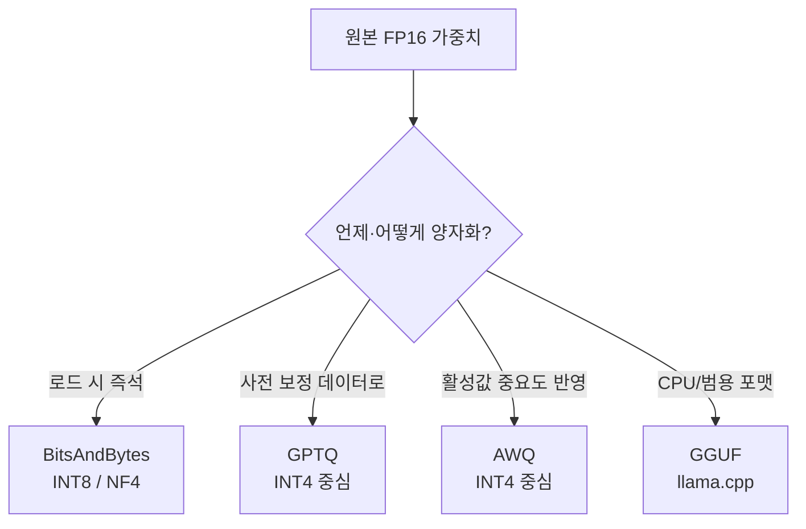

# 심화 8: 양자화 기법 (BitsAndBytes, GPTQ, AWQ, GGUF)

[전체 목차](../README.md) | [deep-dive 목차](00_index.md) | 이전: [vLLM 엔진 아키텍처](07_vllm_engine_architecture.md) | 다음: [LoRA와 QLoRA](09_lora_and_qlora.md)

## 이 문서를 언제 읽나요?

[부록 6: Quantization](../appendix/06_quantization.md)으로 "정밀도를 낮춰 메모리를 줄인다"는 감을 잡은 뒤,
"방식이 왜 이렇게 많고(BnB·GPTQ·AWQ·GGUF) 무엇을 골라야 하는지, 메모리가 줄면 속도도 빨라지는지"를
이해하고 싶을 때 읽습니다.

## 핵심 요약

양자화는 모델 가중치를 FP16/BF16(16비트)에서 **INT8·INT4 같은 더 적은 비트로** 표현해
**메모리를 줄이는** 기법입니다. 메모리가 줄면 더 큰 모델을 같은 GPU에 올리거나
[심화 2](02_kv_cache_and_paged_attention.md)의 KV cache 여유가 생깁니다. 다만 **메모리 절감이
곧 속도 향상은 아니며**, 품질은 방식과 비트 수에 따라 조금씩 손해 봅니다.

## 1. 정밀도와 메모리

가중치 1개가 차지하는 바이트는 정밀도에 정비례합니다.

| 정밀도 | 비트 | 7B 모델 가중치 대략 크기 |
|---|---:|---|
| FP32 | 32 | ~28 GB |
| FP16 / BF16 | 16 | ~14 GB |
| INT8 | 8 | ~7 GB |
| INT4 | 4 | ~3.5 GB |

`.env`의 `DEFAULT_DTYPE`(`auto`/`float16`/`bfloat16`/`float32`)가 양자화하지 않은 기본 정밀도입니다.
INT8/INT4는 별도 **양자화 방식**으로 만든 모델을 써야 합니다.

## 2. 왜 메모리가 줄어도 항상 빨라지진 않나

[심화 1](01_inference_metrics.md)에서 본 두 단계로 나눠 보면 이해됩니다.

- **decode(memory-bound)**: 가중치를 메모리에서 읽는 양이 줄어드니 **빨라질 여지**가 있습니다.
- **그러나** INT4 가중치를 연산 직전 FP16으로 **역양자화(dequantize)**하는 추가 비용이 듭니다.
  커널이 잘 최적화돼 있지 않거나 배치가 크면 이 비용이 이득을 갉아먹습니다.
- **품질**: 비트가 낮을수록 표현 가능한 값이 거칠어져 출력 품질이 떨어질 수 있습니다.

그래서 양자화의 **1차 동기는 "속도"가 아니라 "용량"**입니다. "GPU 한 장에 안 들어가던 모델을
올릴 수 있게 된다"가 가장 확실한 이득입니다.

## 3. 방식 비교

| 방식 | 비트 | 특징 | 잘 맞는 곳 |
|---|---|---|---|
| **BitsAndBytes (BnB)** | INT8, NF4(4bit) | 모델 로드 시 즉석 양자화, 보정 데이터 불필요. QLoRA의 4bit가 이 NF4 | 학습/실험, QLoRA([심화 9](09_lora_and_qlora.md)) |
| **GPTQ** | 주로 INT4 | 보정 데이터로 오차를 최소화하는 **사후(post-training) 양자화** | GPU 추론, 미리 양자화된 모델 배포 |
| **AWQ** | 주로 INT4 | **활성값(activation) 중요도**가 큰 가중치를 보존해 품질 유지 | GPU 추론, 품질 민감 |
| **GGUF** | 다양(2~8bit) | llama.cpp 계열 **파일 포맷**. CPU/혼합 실행에 강함 | CPU·로컬 데스크톱(llama.cpp/Ollama) |

핵심 구분:

- **BnB**는 "로드하면서" 양자화 → 준비가 간단, 추론 최적화는 GPTQ/AWQ보다 약함.
- **GPTQ/AWQ**는 "미리" 양자화한 모델을 받아 씀 → GPU 추론에 최적. AWQ는 품질 보존이 강점.
- **GGUF**는 vLLM의 주력 경로라기보다 **llama.cpp 생태계 포맷**. CPU 중심이면 여기가 자연스럽습니다.

## 4. vLLM에서 양자화 모델 쓰기

vLLM은 보통 **이미 양자화된 모델(GPTQ/AWQ 등)을 그대로 로드**합니다. 일반적으로 모델 식별자만
양자화 버전으로 바꾸면 되고, 필요 시 `--quantization` 옵션으로 방식을 명시합니다(모델 메타데이터로
자동 인식되는 경우가 많음).

이 랩에서는 `local_serve_help.py`가 만드는 `vllm serve <model>`의 `<model>`을 양자화 모델로
바꾸는 것이 출발점입니다. 단, **양자화 커널은 보통 NVIDIA GPU 전제**라
Apple Silicon CPU 경로([setup/04](../setup/04_apple_silicon.md))에서는 대개 동작하지 않습니다.

## 이 프로젝트와 연결되는 지점

- 이 랩의 기본 전략은 **양자화 대신 작은 모델**입니다([`configs/models.small.toml`](../../configs/models.small.toml)의
  0.5B~3B profile). 로컬 학습 단계에서 "양자화 설정으로 씨름하지 않고 일단 돌아가게" 하기 위한 선택입니다.
- 양자화는 **모델이 커서 메모리에 안 들어갈 때** 꺼내는 카드입니다. 그 전에 [심화 2](02_kv_cache_and_paged_attention.md)의
  `DEFAULT_MAX_MODEL_LEN` 축소, [심화 3](03_batching_and_scheduling.md)의 `gpu_memory_utilization` 조절을 먼저 시도하세요.
- QLoRA의 4bit는 여기의 **NF4(BitsAndBytes)**입니다. LoRA 심화에서 이어집니다.

## 관련 문서

- 입문: [부록 6: Quantization](../appendix/06_quantization.md)
- 함께 보기: [KV cache와 PagedAttention](02_kv_cache_and_paged_attention.md), [LoRA와 QLoRA](09_lora_and_qlora.md)
- 환경: [Apple Silicon 설정](../setup/04_apple_silicon.md)
