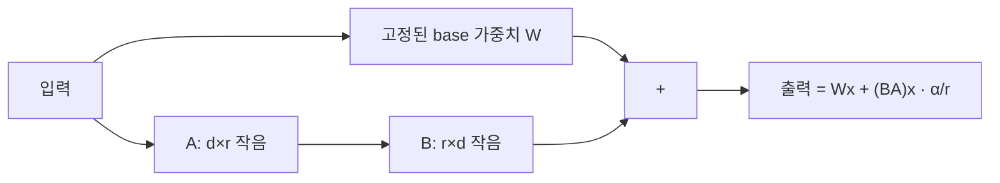
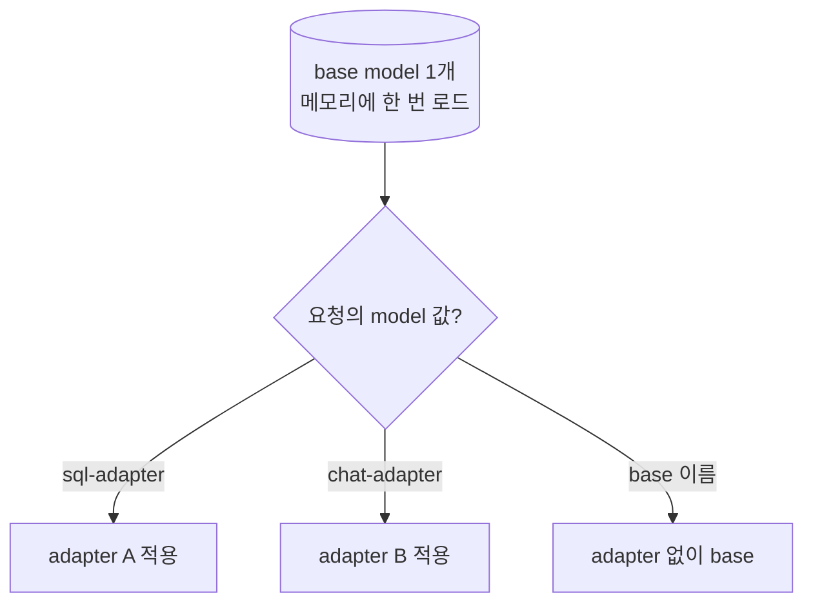

# 심화 9: LoRA와 QLoRA, 멀티 어댑터 서빙

[전체 목차](../README.md) | [deep-dive 목차](00_index.md) | 이전: [양자화 기법](08_quantization_methods.md) | 다음: [Sampling과 guided decoding](10_sampling_and_guided_decoding.md)

## 이 문서를 언제 읽나요?

[부록 7: LoRA와 QLoRA](../appendix/07_lora_qlora.md)와 [실습 7: LoRA serving](../labs/07_lora_serving.md)을
거친 뒤, "adapter가 내부적으로 무엇이고, 왜 작은 파일로 동작하며, vLLM이 어떻게 여러 adapter를
동시에 서빙하는가"를 이해하고 싶을 때 읽습니다.

## 핵심 요약

LoRA는 큰 base model을 **그대로 두고**, 각 가중치 행렬 옆에 **작은 저랭크(low-rank) 행렬 두 개**만
학습해 덧붙이는 방식입니다. 그래서 adapter 파일이 수 MB로 작습니다. QLoRA는 base model을
**4bit로 양자화한 채** LoRA를 학습해 메모리를 더 줄입니다. vLLM은 base model 하나에
**여러 adapter를 얹어** 요청마다 골라 쓸 수 있습니다.

## 1. LoRA의 원리 — 왜 작은가

전체 미세조정(full fine-tuning)은 base model의 **모든 가중치**를 갱신해 결과물이 base와 같은 크기입니다(수 GB~수십 GB).

LoRA의 아이디어: 미세조정으로 생기는 가중치 변화 ΔW는 사실 **저랭크로 근사**할 수 있다.
즉 큰 행렬 ΔW(d×d)를 작은 두 행렬의 곱 **B(d×r) × A(r×d)**로 표현합니다. 여기서 `r`(rank)이 아주 작습니다(예: 8, 16).



학습하는 것은 A·B뿐이므로 **저장할 파라미터가 원본의 수백~수천 분의 1**입니다. 이것이 adapter가
작은 이유입니다.

### 핵심 하이퍼파라미터

| 파라미터 | 의미 | 영향 |
|---|---|---|
| `r` (rank) | 저랭크 행렬의 폭 | 클수록 표현력↑·파일↑, 작을수록 가벼움 (보통 8~64) |
| `lora_alpha` (α) | 스케일 계수 | 적용 강도. 보통 `α/r` 형태로 반영 |
| `target_modules` | LoRA를 붙일 층 | 보통 attention의 `q_proj`,`v_proj` 등 |
| `lora_dropout` | 학습 정규화 | 과적합 완화 |

(이 랩은 training을 다루지 않으므로 이 값들은 **이미 학습된 adapter의 `adapter_config.json`에 들어 있는** 정보입니다.)

## 2. QLoRA — 양자화 + LoRA

QLoRA는 학습 단계에서 메모리를 더 줄이는 기법입니다.

- base model을 **4bit(NF4)로 양자화**해 메모리에 올립니다([심화 8](08_quantization_methods.md)의 BitsAndBytes NF4).
- 그 위에 LoRA adapter(고정밀)를 얹어 **adapter만 학습**합니다.

결과적으로 거대한 base를 작은 GPU에서도 미세조정할 수 있게 됩니다. **추론 시점**에는 보통
학습된 LoRA adapter를 base model에 적용해 사용합니다. 즉 QLoRA는 "학습을 가볍게" 하는 기법이고,
이 랩이 다루는 것은 그 결과물인 **adapter를 서빙**하는 단계입니다.

## 3. adapter 적용 방식: merge vs 동적 로드

- **merge(병합)**: adapter 가중치를 base에 더해 하나의 모델로 합칩니다. 추가 연산이 없지만
  adapter마다 별도 모델이 생기고, 여러 adapter를 동시에 못 씁니다.
- **동적 로드(vLLM 방식)**: base는 한 번만 메모리에 올리고, adapter는 얹은 채 **요청마다 어떤 adapter를
  쓸지 선택**합니다. base 메모리를 공유하므로 여러 adapter를 효율적으로 함께 서빙할 수 있습니다.



vLLM에서 동적 로드는 `--enable-lora`로 켜고, 관련 상한을 둡니다.

- `--max-loras`: 한 배치에 동시에 활성화할 adapter 최대 수
- `--max-lora-rank`: 허용하는 최대 `r`
- `--max-cpu-loras`: CPU에 캐시해 둘 adapter 수

요청은 OpenAI 호환 API의 **`model` 값에 adapter 이름**을 넣어 해당 adapter를 선택합니다.

## 4. 이 랩의 코드와 연결되는 지점

이 랩은 training을 다루지 않고, **이미 있는 adapter를 서빙에 연결하는 흐름과 그 사전 점검**에 집중합니다.

`.env` 설정([실습 7](../labs/07_lora_serving.md)):

```env
ENABLE_LORA=true
LORA_MODULE_NAME=my-adapter
LORA_MODULE_PATH=/path/to/your/adapter
```

`local_serve_help.py`는 이 값이 모두 채워지면 serve 명령에 다음을 붙입니다.

```bash
--enable-lora
--lora-modules my-adapter=/path/to/your/adapter
```

서빙 전에 adapter 파일 구조를 점검하는 것이 [`src/vllm_lab/lora.py`](../../src/vllm_lab/lora.py)입니다.

```python
REQUIRED_ADAPTER_FILES = ("adapter_config.json", "adapter_model.safetensors")
PLACEHOLDER_SAFETENSORS_MAX_BYTES = 16

# check_lora_adapter_path():
#   - 두 필수 파일 존재 여부
#   - adapter_model.safetensors가 16바이트 이하이면 placeholder로 판정
```

- `adapter_config.json`: 위의 `r`, `lora_alpha`, `target_modules` 같은 **adapter 메타데이터**가 담긴 파일.
- `adapter_model.safetensors`: 실제 **A·B 가중치**. 너무 작으면(≤16B) 학습된 weight가 아니라
  경로 연습용 placeholder로 보고 경고합니다([`scripts/run_lora_test.py`](../../scripts/run_lora_test.py)).

호출 시 `model` 값을 base가 아니라 **adapter 이름(`LORA_MODULE_NAME`)**으로 바꿔야 adapter가 적용됩니다.

```python
response = client.chat.completions.create(
    model=settings.lora_module_name,   # base가 아니라 adapter 이름
    messages=[{"role": "user", "content": "이 adapter가 연결됐는지 한 문장으로 확인해 주세요."}],
)
```

## 직접 해보기

학습된 adapter가 없다면 먼저 `run_lora_test.py`로 **경로·구조 점검**까지 통과시키는 것이 목표입니다.

```bash
uv run python scripts/run_lora_test.py
```

`adapter_config.json: ok` / `adapter_model.safetensors: ok`가 보이면 구조 점검 성공입니다.
placeholder 경고가 뜨면 실제 학습된 adapter로 교체해야 응답 품질을 확인할 수 있습니다.

## 관련 문서

- 입문: [부록 7: LoRA와 QLoRA](../appendix/07_lora_qlora.md)
- 실습: [실습 7: LoRA serving](../labs/07_lora_serving.md)
- 함께 보기: [양자화 기법](08_quantization_methods.md)(QLoRA의 4bit), [배치와 스케줄링](03_batching_and_scheduling.md)(adapter 배치)
