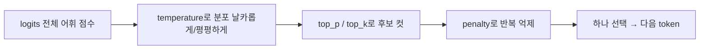

# 심화 10: Sampling과 guided decoding

[전체 목차](../README.md) | [deep-dive 목차](00_index.md) | 이전: [LoRA와 QLoRA](09_lora_and_qlora.md) | 다음: [프레임워크 비교](11_framework_comparison.md)

## 이 문서를 언제 읽나요?

[실습 4: Sampling 설정 바꾸기](../labs/04_sampling.md)에서 `temperature`·`top_p`를 바꿔 본 뒤,
"이 값들이 정확히 무엇을 하고, 출력 형식을 강제(JSON·선택지)하려면 어떻게 하는가"를 알고 싶을 때 읽습니다.

## 핵심 요약

모델은 매 step **다음 token의 확률 분포**를 내놓습니다. sampling 파라미터는 그 분포에서
**어떻게 하나를 고를지**를 정합니다. guided decoding은 한발 더 나아가 **출력이 특정 형식
(선택지/정규식/JSON)을 반드시 따르도록** 분포를 제한합니다.

## 1. 다음 token은 분포에서 뽑힌다

decode 단계마다 모델은 어휘(vocabulary) 전체에 대한 점수(logits)를 만들고, 이를 확률로 바꾼 뒤
하나를 고릅니다. "어떻게 고르느냐"가 출력의 다양성과 안정성을 결정합니다.



## 2. 주요 sampling 파라미터

| 파라미터 | 하는 일 | 올리면 | 내리면 |
|---|---|---|---|
| `temperature` | 분포의 뾰족함 조절 | 다양·창의(무작위↑) | 안정·결정적. `0`이면 greedy |
| `top_p` (nucleus) | 누적확률 `p`까지의 후보만 남김 | 후보 넓음 | 후보 좁음(보수적) |
| `top_k` | 상위 `k`개 후보만 남김 | 후보 넓음 | 후보 좁음 |
| `presence_penalty` | 이미 나온 token 재등장 억제(존재 여부) | 새 주제로 이동 | 반복 허용 |
| `frequency_penalty` | 자주 나온 token일수록 더 억제(빈도) | 반복 줄임 | 반복 허용 |
| `max_tokens` | 생성 길이 상한 | 길게 | 짧게(빠름) |
| `seed` | 난수 고정 | — | 재현성 확보 |

### greedy vs sampling

- **greedy(`temperature=0`)**: 매 step 가장 확률 높은 token만 선택 → **재현 가능·결정적**.
  benchmark나 정답이 중요한 작업, speculative decoding 비교([실습 8](../labs/08_speculative_decoding.md))에 적합.
- **sampling(`temperature>0`)**: 분포에서 무작위 추출 → **다양**. 창의적 생성, 대화에 적합.

`temperature`로 분포의 모양을 바꾼 다음, `top_p`/`top_k`로 "긴 꼬리의 이상한 후보"를 잘라내는 식으로 함께 씁니다.

## 3. 이 랩의 sampling 코드

[`scripts/run_sampling_test.py`](../../scripts/run_sampling_test.py)는 같은 프롬프트에 세 가지 설정을 적용해 출력 차이를 보여줍니다.

```python
samples = [
    ("낮은 temperature", 0.2, settings.default_top_p),
    ("기본 temperature", settings.default_temperature, settings.default_top_p),
    ("높은 top_p", settings.default_temperature, min(1.0, settings.default_top_p + 0.1)),
]
# 각 설정으로 client.chat.completions.create(temperature=..., top_p=..., max_tokens=...)
```

중요한 성질: **sampling 값은 서버가 아니라 요청(request)에 실립니다.** 그래서 값을 바꿔도
서버를 다시 시작할 필요가 없습니다([실습 4](../labs/04_sampling.md)의 "실험해 보기"). 이는
[심화 7](07_vllm_engine_architecture.md)에서 본 것처럼 sampling이 엔진 라이프사이클의
**Sampler 단계**에서 요청별로 적용되기 때문입니다.

기본값은 `.env`에서 옵니다.

```env
DEFAULT_TEMPERATURE=0.7
DEFAULT_TOP_P=0.9
DEFAULT_MAX_TOKENS=256
```

## 4. Guided decoding — 출력 형식을 강제하기

자유 생성은 형식이 들쭉날쭉합니다. guided decoding(structured output)은 매 step **문법에 맞지 않는
token의 확률을 0으로 만들어** 출력이 반드시 정해진 형식을 따르게 합니다. 후처리 파싱 실패를 없앨 수 있습니다.

| 방식 | 강제하는 것 | 예시 용도 |
|---|---|---|
| **choice** | 정해진 선택지 중 하나 | 감정 분류: `Positive`/`Negative` |
| **regex** | 정규식 패턴 | 전화번호·날짜 형식 |
| **json** | JSON 스키마(예: Pydantic) | 구조화된 데이터 추출 |

vLLM은 OpenAI 호환 API의 추가 필드(`guided_choice`, `guided_regex`, `guided_json` 등)나
`response_format`으로 이를 받습니다. 예를 들어 선택지 강제는 요청에 다음을 더하는 식입니다.

```python
response = client.chat.completions.create(
    model=settings.default_model,
    messages=[{"role": "user", "content": "이 리뷰의 감정은? 좋았어요!"}],
    extra_body={"guided_choice": ["Positive", "Negative"]},
)
# 출력은 반드시 "Positive" 또는 "Negative" 중 하나
```

> 주의: guided decoding은 매 step 후보를 제약하므로 약간의 오버헤드가 있고, 백엔드(outlines 등)와
> vLLM 버전에 따라 필드 이름이 다를 수 있습니다. 쓰기 전에 설치된 vLLM 버전의 문서를 확인하세요.

## 직접 해보기

1. `run_sampling_test.py`를 돌려 `temperature=0.2`와 기본값의 출력 다양성 차이를 관찰합니다.
2. `DEFAULT_TEMPERATURE=0`으로 두고 두 번 호출해 **같은 출력(결정적)**이 나오는지 확인합니다.
3. (선택) 위 `guided_choice` 예시로 출력이 선택지로 고정되는지 확인합니다.

```bash
uv run python scripts/run_sampling_test.py
```

## 관련 문서

- 실습: [실습 4: Sampling 설정 바꾸기](../labs/04_sampling.md)
- 함께 보기: [vLLM 엔진 아키텍처](07_vllm_engine_architecture.md)(Sampler 단계), [추론 성능 지표](01_inference_metrics.md)
