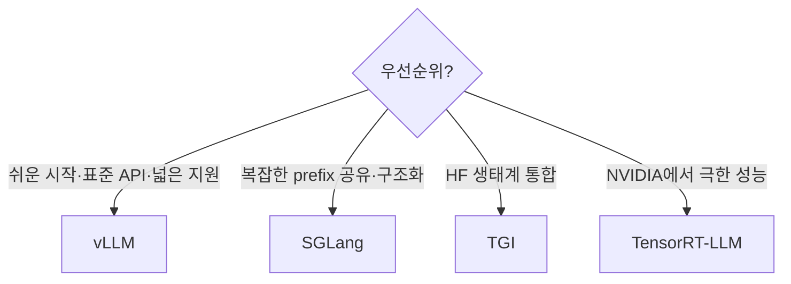

# 심화 11: 서빙 프레임워크 비교 (vLLM, SGLang, TGI, TensorRT-LLM)

[전체 목차](../README.md) | [deep-dive 목차](00_index.md) | 이전: [Sampling과 guided decoding](10_sampling_and_guided_decoding.md)

## 이 문서를 언제 읽나요?

[실습 1: vLLM을 왜 쓰나요?](../labs/01_why_vllm.md)에서 "vLLM을 쓴다"는 선택을 받아들인 뒤,
"다른 선택지(SGLang·TGI·TensorRT-LLM)는 무엇이고, 어떤 기준으로 고르는가"를 알고 싶을 때 읽습니다.

## 핵심 요약

LLM 서빙 프레임워크는 대부분 [심화 2~5](02_kv_cache_and_paged_attention.md)에서 본 기법
(PagedAttention·연속 배치·prefix caching·speculative decoding)을 공유합니다. 차이는
**최적화 강도, 사용 편의성, 생태계, 특화 기능**입니다. 이 랩은 **표준 OpenAI 호환 API + 넓은
모델·하드웨어 지원 + 풍부한 자료** 때문에 학습용으로 vLLM을 씁니다.

## 1. 주요 프레임워크

| 프레임워크 | 만든 곳 | 강점 | 특징 |
|---|---|---|---|
| **vLLM** | UC Berkeley → 커뮤니티 | PagedAttention 원조, 넓은 모델·HW 지원, OpenAI 호환 API | 사실상 표준, 자료 풍부 |
| **SGLang** | 커뮤니티 | RadixAttention(고급 prefix 공유), 복잡한 프롬프트·구조화 출력에 강함 | agent/구조화 워크로드 |
| **TGI** (Text Generation Inference) | Hugging Face | HF 생태계 통합, 안정적 운영 | HF 스택을 쓰는 팀 |
| **TensorRT-LLM** | NVIDIA | NVIDIA GPU에서 최고 수준 성능 | 컴파일 기반, 설정 난도↑, NVIDIA 전용 |

## 2. 무엇이 같고 무엇이 다른가

대부분의 핵심 추론 최적화는 **공통**입니다.

- KV cache의 블록 단위 관리([심화 2](02_kv_cache_and_paged_attention.md))
- 연속 배치([심화 3](03_batching_and_scheduling.md))
- prefix caching([심화 4](04_prefix_caching_internals.md))
- speculative decoding([심화 5](05_speculative_decoding.md))

차이가 나는 지점:

- **prefix 공유 방식**: SGLang의 RadixAttention은 트리 구조로 더 적극적으로 prefix를 공유합니다.
  같은 접두사가 복잡하게 갈라지는 워크로드(에이전트, 다중 분기 프롬프트)에서 강점이 있습니다.
- **성능 vs 편의성**: TensorRT-LLM은 모델을 미리 **컴파일**해 NVIDIA GPU에서 최고 속도를 노리지만,
  빌드·설정이 복잡하고 NVIDIA 전용입니다. vLLM/TGI는 설치·운영이 더 단순합니다.
- **생태계**: TGI는 Hugging Face 스택과, vLLM은 폭넓은 모델·백엔드(NVIDIA/AMD/CPU 등)와 잘 맞습니다.

## 3. 선택 기준 체크리스트

| 질문 | vLLM이 유리한 경우 |
|---|---|
| 표준 OpenAI 호환 API가 필요한가? | 예 — client 코드를 그대로 재사용 |
| 다양한 모델·하드웨어를 빠르게 시도하나? | 예 — 넓은 지원, 모델 식별자만 교체 |
| 학습/자료/커뮤니티가 중요한가? | 예 — 사실상 표준, 예제 풍부 |
| 특정 NVIDIA GPU에서 최후의 1%까지 짜내야 하나? | 이때는 TensorRT-LLM 고려 |
| prefix가 트리처럼 복잡하게 갈라지나? | 이때는 SGLang 고려 |

## 4. 이 랩이 vLLM을 쓰는 이유

- **OpenAI 호환 API**: [심화 7](07_vllm_engine_architecture.md)에서 본 것처럼 이 랩의 모든 client·benchmark가
  표준 `openai` 패키지를 그대로 씁니다. 프레임워크나 클라우드를 바꿔도 호출 코드가 거의 안 바뀝니다.
- **하드웨어 폭**: NVIDIA Linux/WSL부터 Apple Silicon CPU 경로까지 같은 워크플로로 다룰 수 있어
  ([setup](../setup/00_choose_your_environment.md)) 학습 환경 제약이 적습니다.
- **자료와 표준성**: 개념(PagedAttention 등)을 익히면 다른 프레임워크로의 이전이 쉽습니다.

즉 이 랩의 목표는 "최고 성능 프레임워크 선정"이 아니라 **"옮겨갈 수 있는 개념을 표준 도구로 익히기"**이며,
vLLM이 그 목적에 가장 잘 맞습니다.

## 관련 문서

- 실습: [실습 1: vLLM을 왜 쓰나요?](../labs/01_why_vllm.md)
- 함께 보기: [deep-dive 목차](00_index.md)의 추론 최적화 기법들(프레임워크 공통 기반)
- 환경: [환경 선택](../setup/00_choose_your_environment.md)
