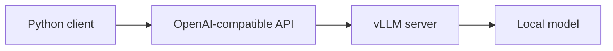

# 실습 1: vLLM을 왜 쓰나요?

[전체 목차](../README.md) | 이전: [공통 `.env` 설정](../setup/01_common_env.md) | 다음: [실습 2](02_local_first_server.md)

## 이번 챕터 목표

vLLM을 사용하는 이유와 이 프로젝트의 local-first 흐름을 이해합니다.

## 예상 시간

5분

## 시작 전 확인

아직 server를 실행하지 않아도 됩니다. 이 챕터는 전체 그림을 잡는 단계입니다.

## 핵심 개념

vLLM은 local model을 HTTP API 뒤에서 실행할 수 있게 해주는 serving 도구입니다.

이 프로젝트에서는 OpenAI-compatible API를 사용합니다. 그래서 local vLLM server도 Python에서 익숙한 `OpenAI` client 형태로 호출합니다.

## 성공 확인

다음 문장이 이해되면 충분합니다.

> 이 프로젝트는 `.env`를 만들고, local `vllm serve`를 실행하고, 같은 Python client로 호출하면서 설정을 바꿔 보는 학습 프로젝트입니다.

## 자주 막히는 지점

vLLM 내부 구조를 먼저 깊게 이해할 필요는 없습니다. 첫 성공은 실습 2와 실습 3에서 만듭니다.

## 다음 챕터

[실습 2: 로컬 vLLM 서버 실행](02_local_first_server.md)
